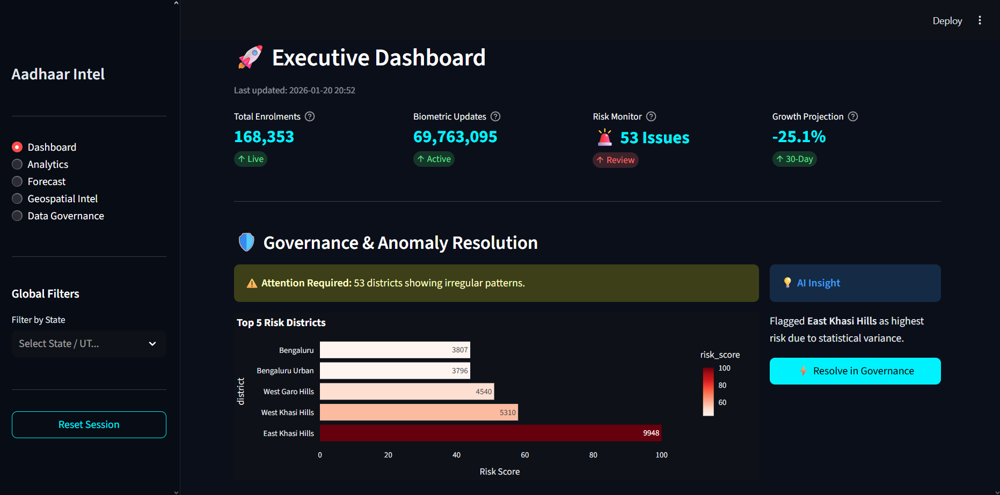
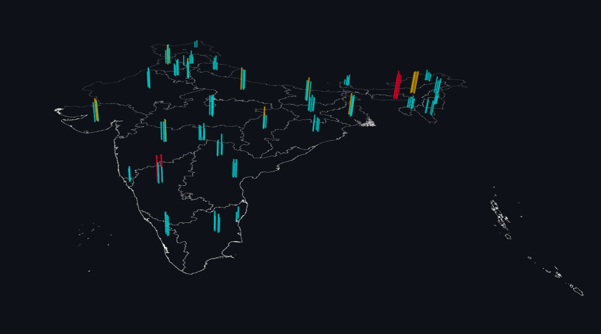
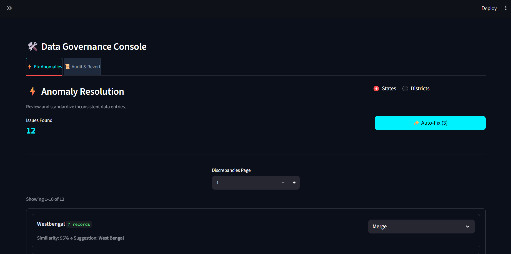

# Aadhaar Intel Engine
### Unlocking Societal Trends in Aadhaar Enrolment and Updates

> **Hackathon Project** | Problem Statement: *Identify meaningful patterns, trends, anomalies, or predictive indicators from Aadhaar enrolment and update data to support informed decision-making and system improvements.*



---

## 🎯 Problem Statement

Aadhaar is India's largest biometric identity platform. Understanding **enrolment patterns, biometric update stress, migration signals, and anomalous activities** at scale is critical for:
- Resource planning
- Fraud/anomaly detection
- Policy insights
- Digital adoption tracking

This project builds an **end-to-end intelligent analytics platform** that ingests raw UIDAI data, applies governance corrections, detects anomalies, forecasts demand, and presents insights through an interactive executive dashboard.

---

## ✨ Key Features

| Module                  | Description                                                                 |
|-------------------------|-----------------------------------------------------------------------------|
| **Executive Dashboard** | Real-time KPIs, risk radar, 30-day forecast snapshot                        |
| **Enterprise Analytics**| Growth trends, operational efficiency, top/bottom performers, export tools  |
| **Predictive Engine**   | Stochastic forecasting with confidence intervals + resource planning        |
| **Geospatial Command**  | 2D/3D/Heatmap visualization of enrolment hotspots across India              |
| **Data Governance**     | Fuzzy matching + Human-in-the-loop correction console for state/district names |
| **Anomaly Detection**   | Isolation Forest-based risk scoring for irregular enrolment patterns        |

---

## 🛠 Tech Stack

- **Frontend**: Streamlit (Custom dark cyber theme)
- **Backend**: Python, Pandas, NumPy
- **ML/Analytics**: Scikit-learn (Isolation Forest), custom stochastic simulator
- **Visualization**: Plotly, PyDeck (3D maps)
- **Data Governance**: Fuzzy string matching + session-state driven repair console

---

## 📁 Project Structure
```
Aadhaar-Intel-Engine/
├── main.py                 # Launcher (auto-downloads GeoJSON)
├── app.py                  # Main Streamlit application
├── src/
│   ├── ai_core.py          # AnalyticsEngine (anomaly, forecast, correlation)
│   ├── data_manager.py     # DataLoader with smart CSV classification
│   ├── components/
│   │   └── navigation.py   # Sidebar + global filters
│   ├── modules/
│   │   ├── dashboard.py    # Executive dashboard
│   │   ├── analytics.py    # Detailed analytics + exports
│   │   ├── predict.py      # Forecasting + resource planning
│   │   ├── command.py      # Geospatial intelligence
│   │   └── data_admin.py   # Governance console (fuzzy fix + audit log)
│   └── utils/
│       └── theme.py        # Custom dark theme styling
├── assets/
│   └── india_states.geojson
├── docs/
│   └── Aadhaar_Intel_Engine_Report.pdf
├── images/                 # Dashboard screenshots & visuals
├── data/                   # (Ignored in Git - large CSVs)
├── output/                 # (Ignored - generated results)
└── requirements.txt
```
---

## 🚀 How to Run

### 1. Clone the repository

```bash
git clone https://github.com/<your-username>/aadhaar-intel-engine.git
cd aadhaar-intel-engine
```

### 2. Install dependencies

```bash
pip install -r requirements.txt
```

### 3. Add your data

Place the Aadhaar CSV files inside the `data/` folder:
- Enrolment files
- Biometric update files
- Demographic files

> **Note**: The `data/` folder is git-ignored. Do not commit large/sensitive CSV files.

### 4. Launch the application

```bash
python main.py
```

The launcher will:
- Automatically download the India states GeoJSON (if missing)
- Launch the Streamlit app in your browser

---

## 📊 Key Insights Delivered

- **Anomaly Detection**: Identified high-risk districts with abnormal 18+ enrolment volumes (potential ghost beneficiaries)
- **Migration Signals**: Detected strong in-migration patterns into Karnataka, Uttar Pradesh, Bihar
- **Operational Efficiency**: Biometric updates occur at ~4.14× the rate of new enrolments
- **Forecasting**: Built stochastic model with confidence bands for 30-day resource planning
- **Data Quality**: Implemented fuzzy + PIN-code aware governance layer to clean inconsistent state/district names

---

## 📸 Screenshots

-  — Executive Dashboard
-  — 3D Command Map
-  — Predictive Intelligence
-  — Data Governance Console

---

## ⚠️ Important Notes

- **Data Privacy**: This repository does **not** contain actual Aadhaar data. The `data/` folder is excluded via `.gitignore`.
- The GeoJSON map is auto-downloaded from a public source on first run.

---

## 📜 License

This project is developed for educational and hackathon purposes.  
Feel free to fork and build upon the ideas.

---


*For any queries regarding the approach or code, feel free to reach out.*