# Aadhaar Intel Engine

<p align="center">
  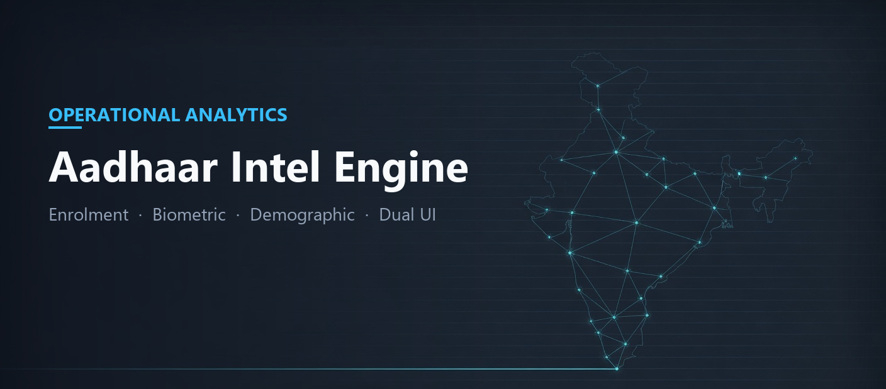
</p>

<p align="center">
  <strong>Unlocking patterns, anomalies, and forecasts in Aadhaar enrolment and updates</strong><br>
  Dual UI · Streamlit research console + React operator app · shared Python engine
</p>

<p align="center">
  
  
  
  
  
</p>

> **Hackathon project** — problem statement: *Identify meaningful patterns, trends, anomalies, or predictive indicators from Aadhaar enrolment and update data to support informed decision-making and system improvements.*

This repository is an end-to-end analytics platform on **UIDAI aggregate counts** (no Aadhaar numbers, no biometrics). It repairs geo labels, scores district-level outliers, forecasts national volume, and serves the same engine through two interfaces.

| Surface | Entry | Role |
|---------|--------|------|
| **Research console** | `python main.py` / `streamlit run app.py` | Dark Streamlit UI for investigation |
| **Operator web app** | `python run_web.py` | Light React + FastAPI UI at `http://127.0.0.1:8787` |

---

## Why it exists

Aadhaar is India's foundational identity system. Enrolment and update **counts** at state / district / PIN grain are useful for:

- Resource planning (where biometric and demographic desks are under load)
- Anomaly investigation (statistical outliers, not fraud verdicts)
- Policy-adjacent trend reading (migration-like hotspots, digital adoption mix)
- Forward-looking staffing envelopes (30-day forecast bands)

Claims in the product are **operational and correlational**. Isolation Forest flags are “look here,” not certified fraud.

---

## Architecture

One analytics stack, two presentation layers. Raw CSV shards are cleaned into daily parquet marts; both UIs call the same `AnalyticsEngine`.

<p align="center">
  
</p>

| Layer | What it does |
|-------|----------------|
| **ETL** | Parse, quarantine bad rows, canonicalize names, repair geo, write marts |
| **Engine** | KPIs, Isolation Forest, forecast bake-off, governance patches |
| **Streamlit** | Dense dark research console |
| **React + FastAPI** | Operator SPA, same filters and modules |

---

## Dual UI

Same KPIs, same filters, same methods. Streamlit is built for research density; React is built for day-to-day operators.

<table>
  <tr>
    <td align="center" width="50%"><strong>Streamlit — Dashboard</strong></td>
    <td align="center" width="50%"><strong>Web — Dashboard</strong></td>
  </tr>
  <tr>
    <td>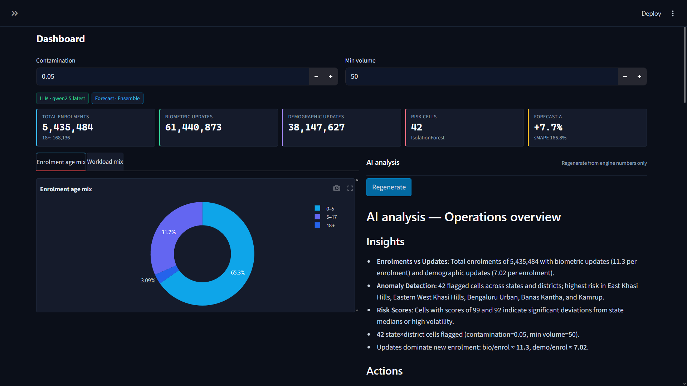</td>
    <td>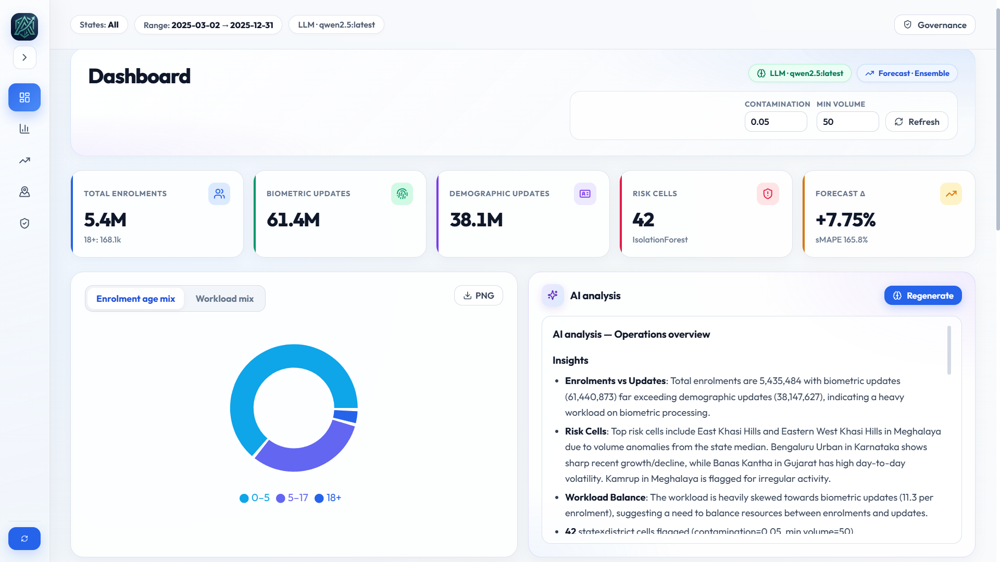</td>
  </tr>
</table>

<table>
  <tr>
    <td align="center" width="50%"><strong>Streamlit — Analytics</strong></td>
    <td align="center" width="50%"><strong>Web — Analytics</strong></td>
  </tr>
  <tr>
    <td>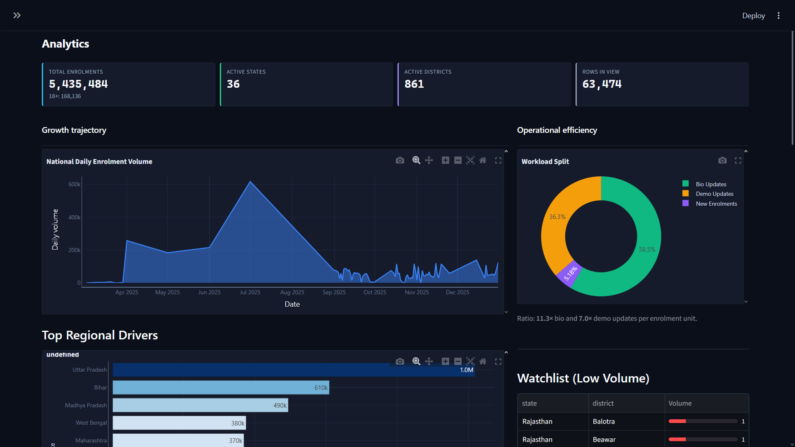</td>
    <td>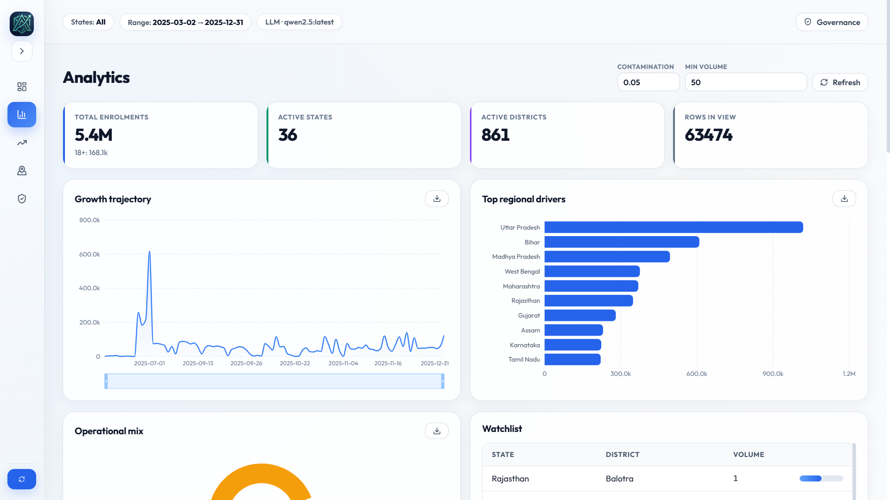</td>
  </tr>
</table>

<table>
  <tr>
    <td align="center" width="50%"><strong>Streamlit — Forecast</strong></td>
    <td align="center" width="50%"><strong>Web — Forecast</strong></td>
  </tr>
  <tr>
    <td>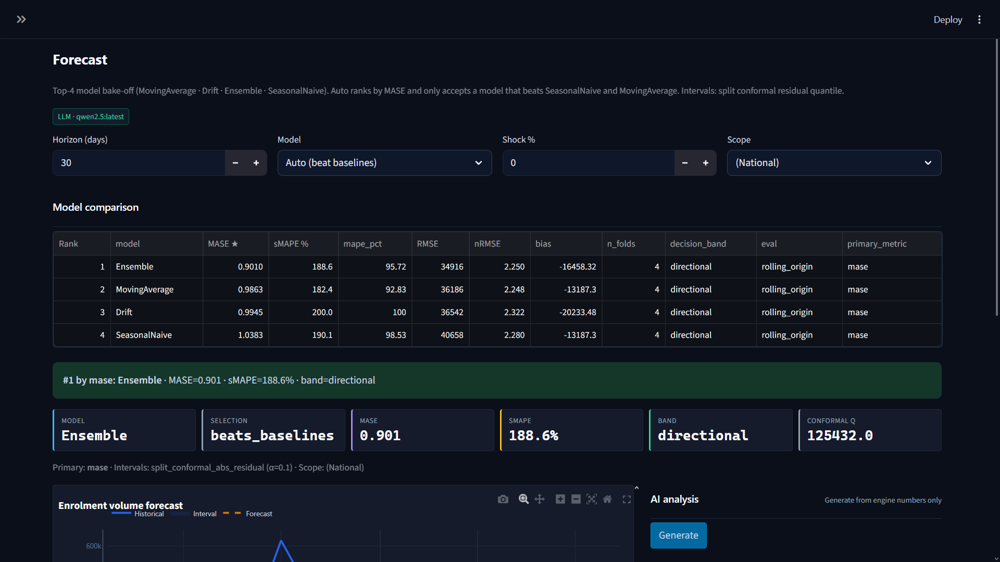</td>
    <td>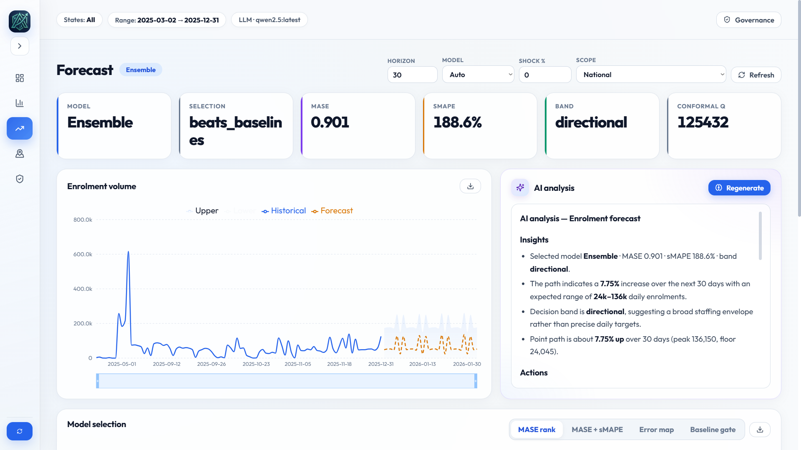</td>
  </tr>
</table>

<table>
  <tr>
    <td align="center" width="50%"><strong>Streamlit — Geospatial Intel</strong></td>
    <td align="center" width="50%"><strong>Web — Geospatial Intel</strong></td>
  </tr>
  <tr>
    <td></td>
    <td>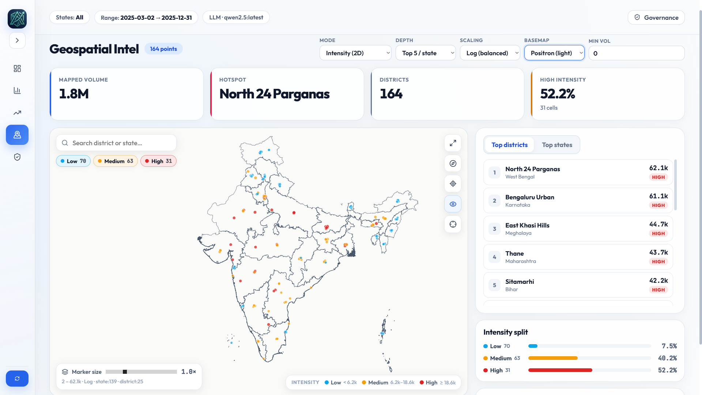</td>
  </tr>
</table>

<table>
  <tr>
    <td align="center" width="50%"><strong>Streamlit — Data Governance</strong></td>
    <td align="center" width="50%"><strong>Web — Data Governance</strong></td>
  </tr>
  <tr>
    <td>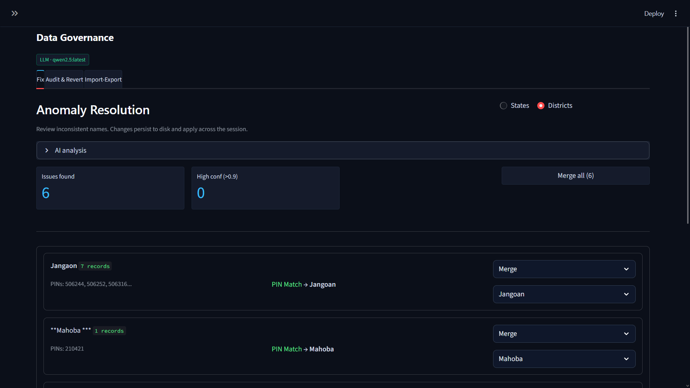</td>
    <td>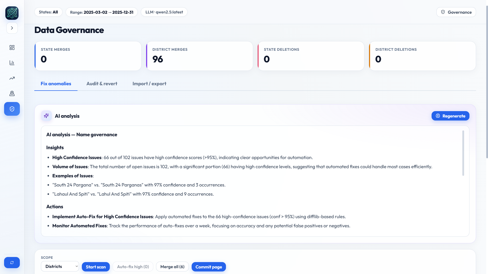</td>
  </tr>
</table>

---

## Modules

| Module | What you get |
|--------|----------------|
| **Dashboard** | Enrolment / bio / demo KPIs, 18+ split, age mix, workload mix, risk cells, 30-day outlook, on-demand AI brief |
| **Analytics** | Growth trajectory, operational ratios, low-volume watchlist, state risk radar, district scatter, CSV export pack |
| **Forecast** | Top-4 bake-off (MASE gate vs naive baselines), Auto selection, conformal bands, resource-planning sketch |
| **Geospatial Intel** | 2D / heatmap / 3D, log or linear scale, district centroids (else state + jitter), intensity legend, CSV / HTML export |
| **Data Governance** | Scan → merge / delete / ignore, audit + revert, import / export patch pack |

---

## Data pipeline

CSV shards land in `data/`. Invalid dates, pincodes, and non-official states are quarantined. Names are canonicalized; district-as-state rows and AP → Telangana boundary cases are repaired. Daily marts are written to `data/processed/`.

<p align="center">
  
</p>

On load the engine:

- Canonicalizes state names (e.g. Orissa → Odisha, Pondicherry → Puducherry)
- Repairs **district-as-state** misfiles (Jaipur → Rajasthan / Jaipur)
- Applies **district aliases** and **AP → Telangana** reassignment
- Quarantines invalid pincodes / residual non-official states
- Collapses duplicate keys by **sum**
- Serves **daily parquet marts** from `data/processed/`

**Total enrolments** = all age bands. **18+** is shown separately.

---

## Methods

### Anomaly detection

Unit of analysis is **state × district**. Cells below `min_volume` are skipped. Isolation Forest scores multi-feature outliers (volume, volatility, bio/demo ratios, trend). Flags are investigation leads, not fraud labels.

<p align="center">
  
</p>

<p align="center">
  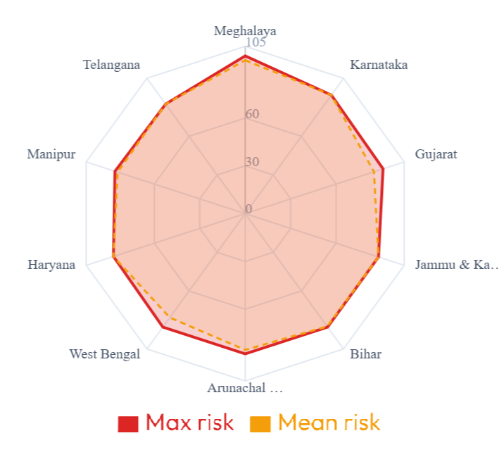
</p>

### Forecasting

Candidates run a rolling bake-off. Auto only deploys a model that **beats SeasonalNaive and MovingAverage** on MASE. Intervals are split-conformal residual quantiles (P10–P90), not guarantees.

<p align="center">
  
</p>

<p align="center">
  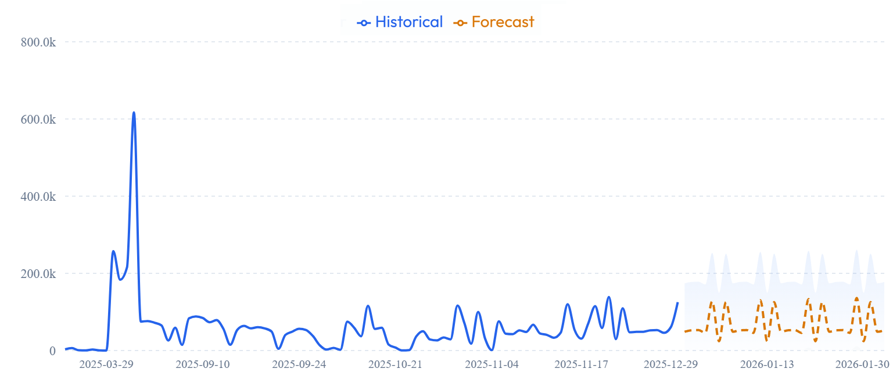
</p>

### Data governance

Scan proposes merges / deletes from fuzzy name matches. A human applies, ignores, or reverts. Patches and an audit log persist under `output/` and hot-reload into the working frames.

<p align="center">
  
</p>

### AI briefs

Insights are grounded in engine numbers. If Ollama is up, a strict prompt produces a Finding / Evidence / Method / Limitations brief. If not, the same template is filled deterministically.

<p align="center">
  
</p>

<p align="center">
  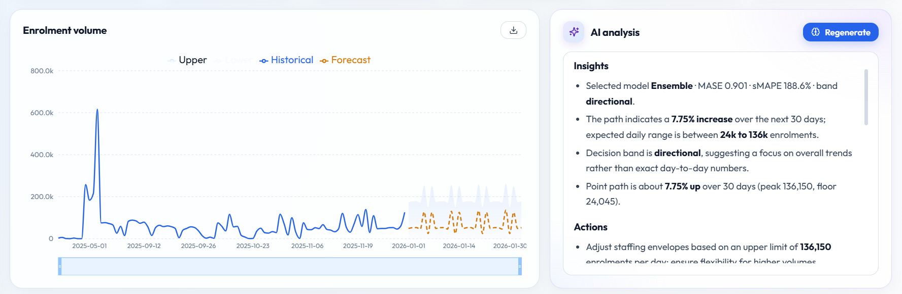
</p>

| Analysis | Unit | Method | Reported metrics |
|----------|------|--------|------------------|
| Forecast | National (or per-state) daily volume | Holdout / rolling bake-off; Auto by **MASE** vs baselines | MASE, sMAPE, RMSE, nRMSE, P10–P90 |
| Anomalies | **state × district** | Isolation Forest + `min_volume` | `risk_score`, driver, investigation notes |
| Geospatial | District points | District centroid if known; else state + jitter | `centroid_source` |
| Insights | Current view | Grounded LLM or deterministic draft | Evidence from engine only |

---

## How to run

### 1. Clone and install

```bash
git clone https://github.com/NetRunnerXD/Aadhaar-Intel-Engine-UIDAI.git
cd Aadhaar-Intel-Engine-UIDAI
pip install -r requirements.txt
```

### 2. Add data

Place aggregate CSV shards in `data/` (see [`data/README.md`](data/README.md)). A full extract is typically ~200 MB / ~5M rows across enrolment, biometric, and demographic shards.

### 3. Optional: build marts

Cold CSV parse is ~15s. Parquet reads are sub-second.

```bash
python -m src.etl.build_cache
```

The app also builds `data/processed/` on first load when CSVs are present.

### 4. Streamlit research console

```bash
python main.py
```

or

```bash
python -m streamlit run app.py
```

The launcher downloads India states GeoJSON if it is missing.

### 5. React operator UI

Needs **Node.js 18+** for the one-time frontend build. Same Python engine.

```bash
python run_web.py
```

Opens **http://127.0.0.1:8787** — Dashboard, Analytics, Forecast, Geospatial, Governance.

```bash
python run_web.py --skip-build    # reuse web/frontend/dist
python run_web.py --port 9000
```

Dev mode (API + Vite HMR):

```bash
python run_web.py --dev-api --port 8787
cd web/frontend && npm install && npm run dev
```

### Marts-only (shared hosts)

```bash
set MARTS_ONLY=1
python -m src.etl.build_cache --force   # or scripts/refresh_marts.ps1
python main.py
```

### Local LLM (optional)

```bash
ollama pull qwen2.5:latest
set OLLAMA_HOST=http://127.0.0.1:11434
set OLLAMA_MODEL=qwen2.5:latest
```

If Ollama is offline, briefs still render from computed metrics.

---

## Project structure

```
Aadhaar-Intel-Engine-UIDAI/
├── main.py                 # Streamlit launcher (GeoJSON bootstrap)
├── app.py                  # Streamlit research console
├── run_web.py              # React + FastAPI operator UI
├── requirements.txt
├── web/
│   ├── api/                # FastAPI — reuses src analytics
│   └── frontend/           # React + Vite SPA
├── src/
│   ├── ai_core.py          # AnalyticsEngine
│   ├── data_manager.py     # Cache-first load, validate, normalize
│   ├── etl/build_cache.py  # CSV → parquet marts
│   ├── forecasting.py      # Bake-off + conformal bands
│   ├── geo/                # Canonicalize, repair, centroids
│   ├── modules/            # Dashboard, analytics, predict, map, governance
│   └── services/           # Filters + durable governance store
├── assets/                 # GeoJSON + official-state / alias tables
├── data/                   # Git-ignored CSVs + processed marts
├── tests/
└── images/
    ├── banner.png
    ├── Architecture Diagrams/
    ├── Plots/
    ├── Streamlit/
    └── Web/
```

---

## Notes

- **Privacy.** This repo does **not** ship Aadhaar numbers or biometric samples. Only aggregate counts. `data/` is git-ignored.
- **RAM.** ≥2 GB with daily marts; ≥4 GB if you fall back to full PIN-grain CSV.
- **Global filters** (state + date) apply to Dashboard, Analytics, Forecast, and Geospatial.
- **Governance** patches live in `output/` across restarts.

---

## License

Developed for educational and hackathon use. Fork and extend freely.
