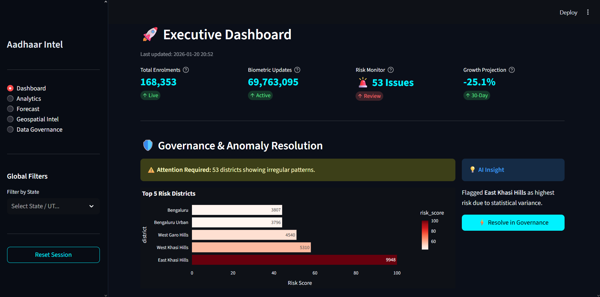
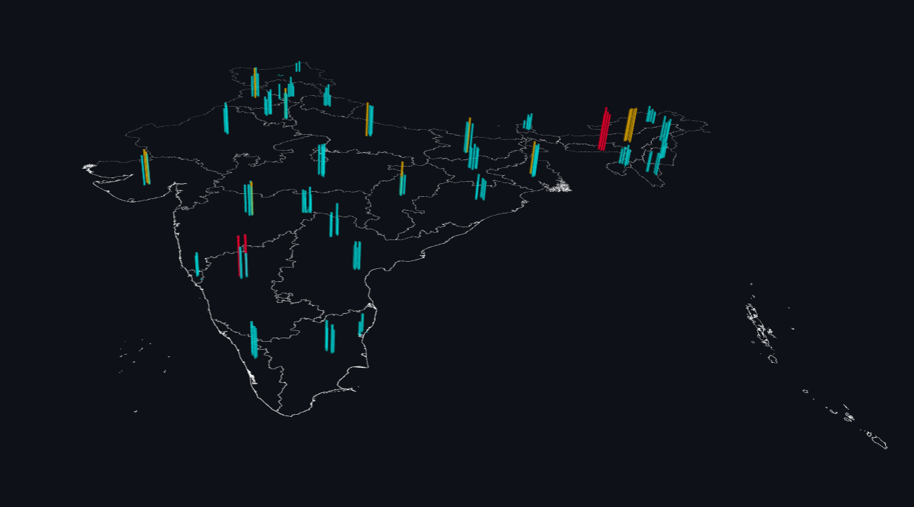
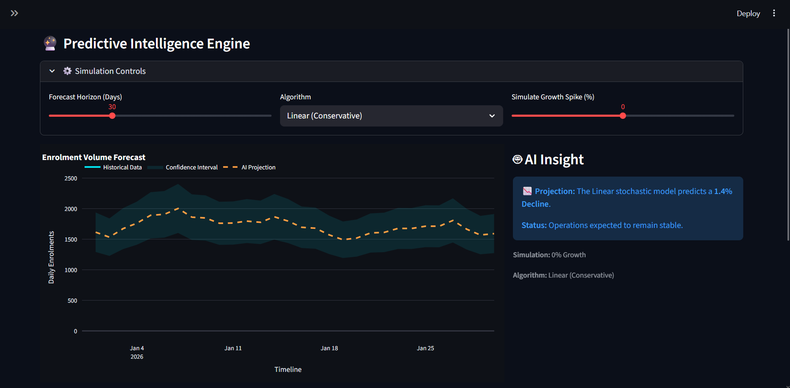
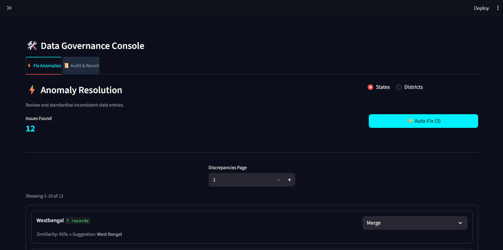

# Aadhaar Intel Engine
### Unlocking Societal Trends in Aadhaar Enrolment and Updates

> **Hackathon Project** | Problem Statement: *Identify meaningful patterns, trends, anomalies, or predictive indicators from Aadhaar enrolment and update data to support informed decision-making and system improvements.*



---

## Problem Statement

Aadhaar is India's largest biometric identity platform. Understanding **enrolment patterns, biometric update stress, migration signals, and anomalous activities** at scale is critical for:

- Resource planning
- Fraud/anomaly detection
- Policy insights
- Digital adoption tracking

This project builds an **end-to-end intelligent analytics platform** that ingests raw UIDAI aggregate data, applies governance corrections, detects anomalies, forecasts demand, and presents insights through an interactive executive dashboard.

---

## Key Features

| Module | Description |
|--------|-------------|
| **Executive Dashboard** | KPIs (total + adult enrolments, bio, demo), age mix, risk radar, 30-day simulation |
| **Enterprise Analytics** | Growth trends, operational efficiency, exports |
| **Predictive Engine** | Seeded stochastic projections with confidence bands + resource planning |
| **Geospatial Command** | 2D/3D/Heatmap visualisation of enrolment hotspots |
| **Data Governance** | Fuzzy matching + human-in-the-loop correction console |
| **Anomaly Detection** | Isolation Forest risk scoring on district enrolment volume |

---

## Tech Stack

- **Streamlit app:** interactive research UI (`app.py`) — unchanged
- **Professional web UI:** React + Vite + FastAPI (`python run_web.py`)
- **Backend:** Python, Pandas, NumPy, same `AnalyticsEngine` / marts
- **ML/Analytics:** Scikit-learn Isolation Forest, multi-model forecast bake-off
- **Visualization:** Plotly / PyDeck (Streamlit); Recharts + Leaflet (web)
- **Data quality:** Geo repair + durable governance patches

---

## Project Structure

```
Aadhaar-Intel-Engine-UIDAI/
├── main.py                 # Launcher (auto-downloads GeoJSON)
├── app.py                  # Streamlit application (kept as-is)
├── run_web.py              # Professional React web UI (single entry)
├── web/
│   ├── api/                # FastAPI (reuses src analytics)
│   └── frontend/           # React + Vite SPA
├── requirements.txt
├── src/
│   ├── config.py           # Paths and defaults
│   ├── ai_core.py          # AnalyticsEngine
│   ├── data_manager.py     # Load (cache-first), validate, normalize, dedupe
│   ├── etl/build_cache.py  # CSV → parquet marts CLI
│   ├── geo/normalize.py    # State canonicalization
│   ├── services/filters.py # Global filters
│   ├── components/navigation.py
│   ├── modules/            # Dashboard, analytics, predict, command, data_admin
│   └── utils/theme.py
├── assets/
│   ├── india_states.geojson
│   └── reference/          # official_states.json, state_aliases.json
├── data/                   # Git-ignored CSVs + processed/ (see data/README.md)
├── docs/
├── images/
└── figures/
```

---

## How to Run

### 1. Clone

```bash
git clone https://github.com/NetRunnerXD/Aadhaar-Intel-Engine-UIDAI.git
cd Aadhaar-Intel-Engine-UIDAI
```

### 2. Install dependencies

```bash
pip install -r requirements.txt
```

### 3. Add data

Place aggregate CSV shards in `data/` (see `data/README.md`). Typical volume for a full extract is ~200 MB / ~5M rows across enrol + bio + demo.

### 4. (Optional) Build processed cache

Speeds cold start from ~15s CSV parse to sub-second parquet reads:

```bash
python -m src.etl.build_cache
```

The app also auto-builds `data/processed/` on first load when CSVs are present.

### 5. Launch

```bash
python main.py
```

Or:

```bash
python -m streamlit run app.py
```

The launcher will download India states GeoJSON if missing, then open the app.

### 6. Professional web UI (React)

Requires **Node.js 18+** (for the one-time frontend build). Uses the **same Python analytics engine** as Streamlit.

```bash
pip install -r requirements.txt
python run_web.py
```

Opens **http://127.0.0.1:8787** with Dashboard, Analytics, Forecast, Geospatial, and Governance.

```bash
python run_web.py --skip-build    # reuse web/frontend/dist
python run_web.py --port 9000
```

Dev mode (API + Vite HMR):

```bash
python run_web.py --dev-api --port 8787
cd web/frontend && npm install && npm run dev
```

---

## Data quality (production notes)

On load the engine:

- Canonicalizes state names (e.g. Orissa → Odisha, Pondicherry → Puducherry)
- Repairs **district-as-state** misfiles (Jaipur → Rajasthan/Jaipur, etc.)
- Applies **district aliases** and **AP → Telangana** boundary reassignment
- Quarantines invalid pincodes / residual non-official states
- Collapses duplicate keys by **sum**
- Serves **daily parquet marts** from `data/processed/`

**Metrics:** “Total Enrolments” = all age bands; “18+” shown separately.

**Forecasts:** seasonal Ridge regression + residual bootstrap CI + holdout MAPE/RMSE.

**Anomalies:** multi-feature Isolation Forest (volume, CV, bio/demo ratios, trend).

**Governance:** patches/audit persist under `output/` across restarts; import/export pack JSON.

**Global filters** (state + date) apply to Dashboard, Analytics, Forecast, and Geospatial.

### Ollama (local LLM insights)

```bash
ollama pull qwen2.5:latest
set OLLAMA_HOST=http://127.0.0.1:11434
set OLLAMA_MODEL=qwen2.5:latest
```

Insights use a **research template** (Finding / Evidence / Method / Limitations).  
If Ollama is offline, the same structure is filled from computed metrics only.

### Research methods (P1)

| Analysis | Unit | Method | Reported metrics |
|----------|------|--------|------------------|
| Forecast | National daily volume | Holdout bake-off: Seasonal, Linear Ridge, MovingAverage; auto-select by **sMAPE** | MAPE, sMAPE, RMSE, P10–P90 residual bootstrap |
| Anomalies | **state × district** | IsolationForest on scaled multi-features + min_volume filter | risk_score, driver feature, investigation notes |
| Geospatial | District points | District centroid table when known; else state centroid + jitter | `centroid_source` |
| Insights | — | Grounded LLM or deterministic research draft | Evidence JSON only |

**Marts-only (recommended for shared hosts):**

```bash
set MARTS_ONLY=1
python -m src.etl.build_cache --force   # or scripts/refresh_marts.ps1
python main.py
```

Claims are **operational / correlational**, not causal policy or fraud conclusions.

---

## Key Insights (illustrative from full extract)

- Biometric and demographic **update** volumes dominate new enrolment counts
- District-level naming aliases and AP/Telangana boundary mismatches need governance
- Isolation Forest flags high-volume districts — interpret with operational context

---

## Screenshots

| Executive Dashboard | 3D Geospatial Command Map |
|---------------------|---------------------------|
|  |  |

| Stochastic Forecast | Data Governance Console |
|---------------------|-------------------------|
|  |  |

---

## Important Notes

- **Data privacy:** This repository does **not** contain Aadhaar numbers or biometrics. Only aggregate counts. The `data/` folder is excluded via `.gitignore`.
- GeoJSON is auto-downloaded from a public source on first run if missing.
- Recommended RAM: **≥2 GB** with processed daily marts; **≥4 GB** if falling back to full CSV pin-grain processing.

---

## License

Developed for educational and hackathon purposes. Fork and extend freely.

---

*For questions about the approach or code, feel free to reach out.*
