# Aadhaar Intel Engine — Research Outcomes

**Project:** Aadhaar Intel Engine (UIDAI operational aggregates)  
**Problem framing:** Identify patterns, trends, anomalies, and predictive indicators from Aadhaar enrolment and update aggregates to support informed operations—not individual identity adjudication.  
**Repository:** [NetRunnerXD/Aadhaar-Intel-Engine-UIDAI](https://github.com/NetRunnerXD/Aadhaar-Intel-Engine-UIDAI)  
**Document type:** Research outcomes report (code-aligned)  
**Status:** Living document — replace placeholders and fill measured tables after each capture run  

> **Important disclaimers (from implementation):**  
> - Isolation Forest scores are unsupervised multi-feature outliers (“look here”), **not fraud labels**.  
> - Forecasts and decision bands guide planning envelopes; they are **not guarantees**.  
> - Data are **aggregate** enrolment/update volumes (no Aadhaar numbers or biometrics).  

---

## How to use this document

| Action | Convention |
|--------|------------|
| Screenshots | Prefer `docs/live_captures/` from `python docs/capture_live_assets.py` |
| Static figures | Prefer `images/` or `figures/` |
| New assets | Drop files under `docs/figures/` (create if needed) and update paths below |
| Placeholders | Blocks marked **`[FIGURE — …]`** or **`[TABLE — fill]`** are intentional slots |

**Suggested capture pipeline**

```text
python -m src.etl.build_cache          # optional: refresh marts
streamlit run app.py                   # or: python run_web.py
python docs/capture_live_assets.py     # writes docs/live_captures/*
```

---

## 1. Executive summary of outcomes

### 1.1 What was built

An end-to-end **research and operations analytics stack** that:

1. **Ingests** multi-shard UIDAI-style CSV aggregates (enrolment, biometric updates, demographic updates).  
2. **Repairs geography** via a versioned rule pack (aliases, district-as-state, AP→Telangana, PIN fallback) with optional gold evaluation.  
3. **Materialises** daily parquet marts (`date × state × district`) for fast reload.  
4. **Applies durable human governance** (merge/delete patches + audit).  
5. **Detects multi-feature district outliers** (Isolation Forest).  
6. **Forecasts** national or state daily enrolment via a multi-model bake-off with baseline gate and split-conformal intervals.  
7. **Maps** volume intensity (2D / heatmap / 3D) on a light basemap with district centroids.  
8. **Surfaces** hybrid AI briefs (engine-authored numbers + optional Ollama narrative).  
9. **Exposes** two UIs: Streamlit research app and React + FastAPI professional web UI sharing the same engine.

### 1.2 Primary research contributions

| # | Outcome | Evidence in codebase |
|---|---------|----------------------|
| C1 | **Production-style geo repair pipeline** with measurable rule pack and gold eval harness | `src/geo/*`, `assets/reference/*`, `tests/test_geo_repair.py` |
| C2 | **Cache-first analytics marts** that separate pin-level natural keys from daily ops grain | `src/data_manager.py`, `src/etl/build_cache.py`, `CACHE_SCHEMA_VERSION` |
| C3 | **Multi-feature Isolation Forest** at state×district with reason codes and investigation notes | `src/ai_core.py` |
| C4 | **Research-grade forecast selection**: rolling CV, MASE primary, beat SN+MA gate, conformal bands | `src/forecasting.py`, `src/config.py` |
| C5 | **Human-in-the-loop governance** with durable patches and audit (not one-off spreadsheet fixes) | `src/services/governance_store.py`, governance UI |
| C6 | **Evidence-locked hybrid AI** so LLM prose cannot invent metrics | `src/ai/research_insights.py` |
| C7 | **Dual presentation layer** with Streamlit ↔ React feature parity | `app.py`, `web/`, `web/FEATURE_PARITY.md` |

### 1.3 Headline visual

<!-- FIGURE: system at a glance -->


*Figure 1. Architecture overview (replace/update with latest diagram if needed).*  

**`[FIGURE — optional architecture refresh]`**  
Path: `docs/figures/architecture_latest.png`  
Caption: *Dual UI (Streamlit + React) over shared AnalyticsEngine, marts, and governance store.*

---

## 2. Problem, scope, and research questions

### 2.1 Operational problem

Public Aadhaar dashboards often stop at totals and maps. Operational teams need:

- Clean, comparable geography across noisy free-text place names  
- Transparent outlier investigation at district grain  
- Demand outlook with uncertainty, not a single curve  
- Governance that survives reloads  

### 2.2 Research questions (as implemented)

| ID | Question | Approach in system |
|----|----------|--------------------|
| RQ1 | Can automated geo rules recover official states/districts at high accuracy on a gold set? | Rule pack + `evaluate_geo_cleaning` |
| RQ2 | Do multi-feature outliers surface actionable investigation cells beyond raw volume spikes? | Isolation Forest on volume, CV, bio/demo ratios, WoW growth, etc. |
| RQ3 | When should a complex forecast beat simple baselines on noisy daily enrolment series? | Bake-off + baseline gate |
| RQ4 | Can hybrid AI assist operators without fabricating numbers? | Evidence dict → deterministic draft → optional LLM |
| RQ5 | Can a professional web UI retain research fidelity of the Streamlit prototype? | Shared engine + FastAPI + React |

### 2.3 Non-goals (explicit)

- Individual-level identity, biometric matching, or legal fraud determination  
- Claiming causal migration or policy impact from aggregates alone  
- Guaranteeing forecast accuracy under structural breaks without re-evaluation  

---

## 3. Data and methods

### 3.1 Data contracts

| Stream | Grain (raw) | Daily mart grain | Core metrics |
|--------|-------------|------------------|--------------|
| Enrolment | date × state × district × pincode | date × state × district | age bands, adult/total enrolments |
| Biometric updates | same | date × state × district | bio age bands, bio stress |
| Demographic updates | same | date × state × district | demo age bands, update volume |

Natural key for de-duplication: `date, state, district, pincode` (`NATURAL_KEY`).  
Analytics grain: `date, state, district` (`DAILY_KEY`).

**`[TABLE — fill after load]` Dataset inventory**

| Source files | Rows (enrol / bio / demo) | Date min | Date max | Notes |
|--------------|---------------------------|----------|----------|-------|
| *fill* | *fill* | *fill* | *fill* | From sidebar / `/api/meta` |

### 3.2 Ingest and mart construction

```text
CSV shards
  → classify (enrol / bio / demo)
  → validate dates & pincode range
  → quarantine invalid rows
  → collapse NATURAL_KEY duplicates (sum)
  → canonicalize state
  → full_geo_repair
  → optional AUTO_BUILD_CACHE → parquet marts + manifest fingerprint
```

**`[FIGURE — data pipeline diagram]`**  
Path: `docs/figures/pipeline_etl.png`  
Caption: *Ingest → repair → marts → filters → engine.*  

*Related live diagram (if present):*  
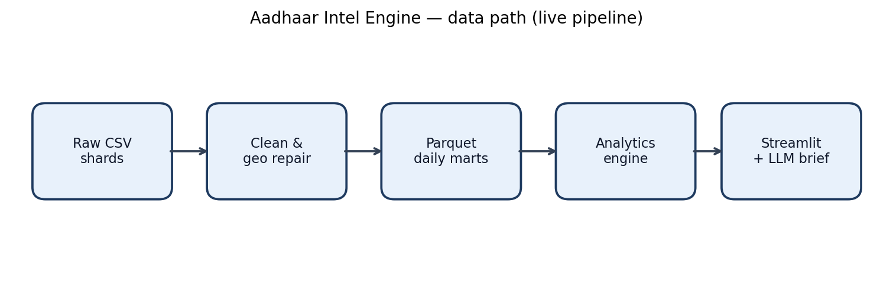

### 3.3 Geography repair (RQ1)

Ordered stages in `full_geo_repair()`:

1. **District typed as state** (`district_as_state.json` + corpus majority map)  
2. **District aliases** (`district_aliases.json`)  
3. **AP → Telangana boundary** (allowlist of Telangana districts still tagged Andhra Pradesh)  
4. **PIN prefix → state** fallback when state remains non-official  

Rule pack version: **`GEO_RULE_PACK_VERSION = 1.1.0`**.  
Gold evaluation: `assets/reference/eval_geo_gold.json` via `evaluate_geo_cleaning` (tests require high state/both accuracy).

**`[TABLE — fill from load_report / eval]` Geo repair outcomes**

| Metric | Value | Source |
|--------|-------|--------|
| district_as_state repairs | *fill* | `load_report.geo_repair_stats` |
| district_aliases applied | *fill* | same |
| ap_to_telangana reassignments | *fill* | same |
| pin_prefix_fallback rows | *fill* | same |
| Gold state accuracy | *fill* | `geo_eval` / test harness |
| Gold both accuracy | *fill* | same |
| Rule pack version | 1.1.0 | config |

**`[FIGURE — geo repair before/after sample]`**  
Path: `docs/figures/geo_repair_example.png`  
Caption: *Example rows: misfiled state → official state; AP+Nalgonda → Telangana.*

### 3.4 Governance (human overrides)

- Scans for residual state/district name issues (PIN overlap heuristics via `dim_geo`)  
- Actions: **Merge / Delete / Ignore** with pagination, auto-fix high confidence, merge-all confirm  
- Durable store: `output/governance_patches.json` + `output/governance_audit.csv`  
- Import/export pack JSON  

**`[FIGURE — governance UI]`**  
  
*Also:* 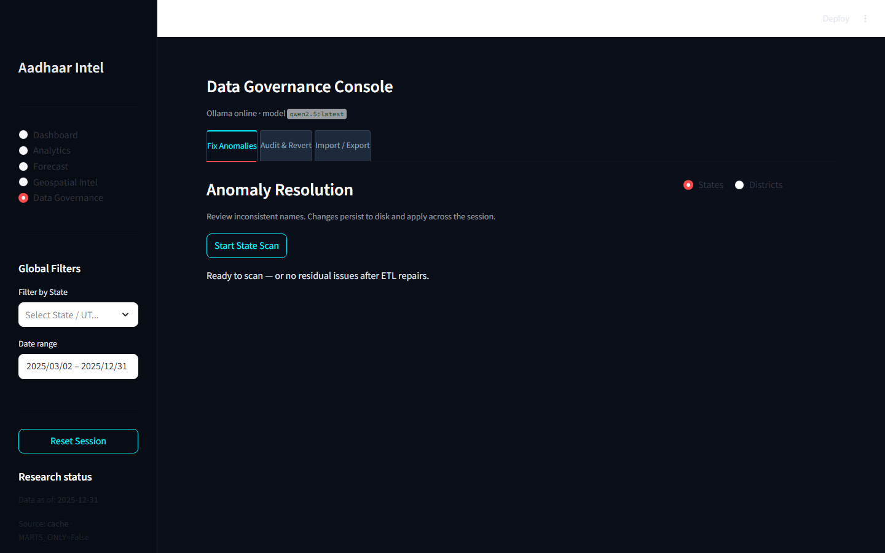

### 3.5 Anomaly detection (RQ2)

**Unit of analysis:** state × district (composite cell).  

**Features (per cell):** volume, log volume, day-to-day CV, bio ratio, demo ratio, week-over-week growth, active days, volume vs state median.  

**Model:** `sklearn.ensemble.IsolationForest`  
- Default contamination `0.05` (UI: 0.01–0.15)  
- Default min volume `50`  
- `n_estimators=200`, fixed `random_state`  

**Outputs:** risk score (scaled for outliers), top feature → reason text, investigation notes.  

**`[FIGURE — anomaly scatter / bars]`**  
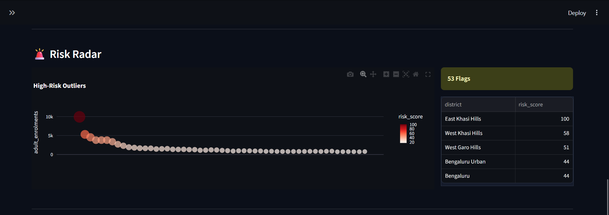  
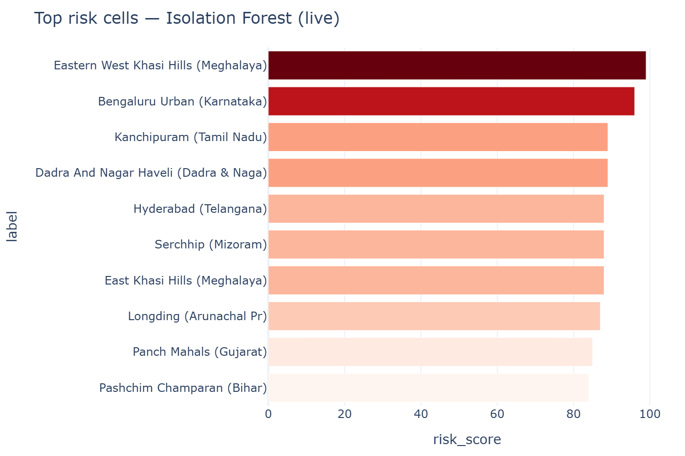  
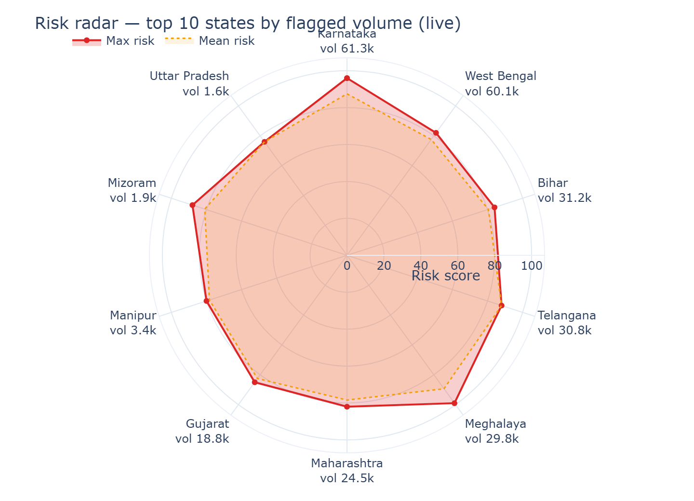

**`[TABLE — fill from Analytics/Dashboard]` Top risk cells (example run)**

| State | District | Volume | Risk | Reason | bio | demo | cv |
|-------|----------|--------|------|--------|-----|------|-----|
| *fill* | *fill* | *fill* | *fill* | *fill* | *fill* | *fill* | *fill* |

### 3.6 Forecasting (RQ3)

**Series:** national or single-state daily enrolment; missing calendar days filled with 0 (preserves DOW structure).  

**Candidates:** MovingAverage, Drift, Ensemble, SeasonalNaive.  

**Evaluation:** rolling-origin CV when history allows (else single holdout).  

**Auto selection:**

1. Rank by primary metric (**MASE** by default).  
2. Accept SeasonalNaive / MovingAverage / Drift if best.  
3. Accept other winners (e.g. Ensemble) only if they **strictly beat both** SeasonalNaive and MovingAverage on MASE (`FORECAST_BEAT_BASELINE_EPS = 0`).  
4. Else fall back to better of SN vs MA.  

**Intervals:** split conformal absolute residual quantile (`α = 0.1`).  

**Decision bands**

| Band | MASE | sMAPE (fallback) | Ops meaning |
|------|------|------------------|-------------|
| tight | &lt; 0.85 | &lt; 20% | finer short-horizon planning |
| directional | &lt; 1.15 | &lt; 40% | direction / envelope |
| exploratory | ≥ 1.15 | ≥ 40% | monitor actuals closely |

**`[FIGURE — forecast path]`**  
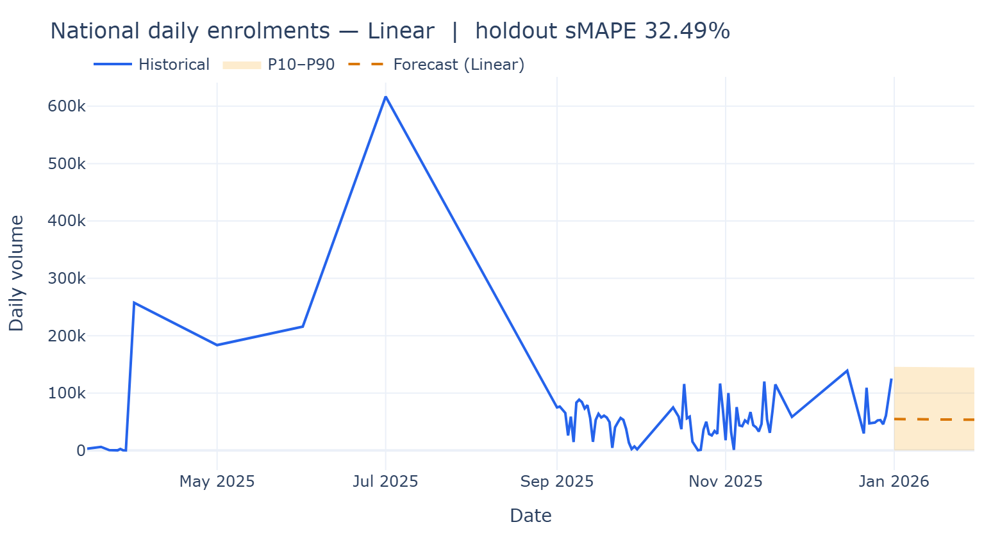  
  
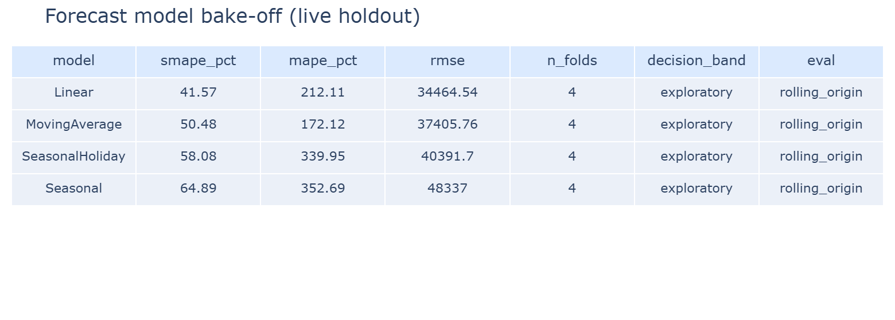

**`[FIGURE — model selection views]`**  
Path: `docs/figures/model_selection_mase_rank.png`  
Caption: *MASE rank with best-baseline reference (from Forecast → Model selection).*  

Path: `docs/figures/model_selection_baseline_gate.png`  
Caption: *Δ MASE vs best baseline (green = beats gate).*  

**`[TABLE — fill from Forecast UI]` Bake-off (example run, scope: National / *state*)**

| Rank | Model | MASE | sMAPE % | RMSE | Band | Folds | Selected? |
|------|-------|------|---------|------|------|-------|-----------|
| 1 | *fill* | *fill* | *fill* | *fill* | *fill* | *fill* | |
| 2 | *fill* | *fill* | *fill* | *fill* | *fill* | *fill* | |
| 3 | *fill* | *fill* | *fill* | *fill* | *fill* | *fill* | |
| 4 | *fill* | *fill* | *fill* | *fill* | *fill* | *fill* | |

Selection reason (from meta): *`beats_baselines` / `best_baseline_or_top` / `baseline_gate_blocked` / …* → **`[fill]`**

### 3.7 Geospatial analytics

- Prefer **district centroids**; else state centroid + jitter (`centroid_source` exposed).  
- Intensity bands: bottom 10% / 10–30% / top of volume range (same colour logic as Streamlit).  
- Modes: intensity scatter, heatmap, 3D columns; log vs linear size/elevation.  
- Web UI: fullscreen map, basemap switch, intensity chips, rankings, fly-to hotspot.  

**`[FIGURE — map]`**  
  
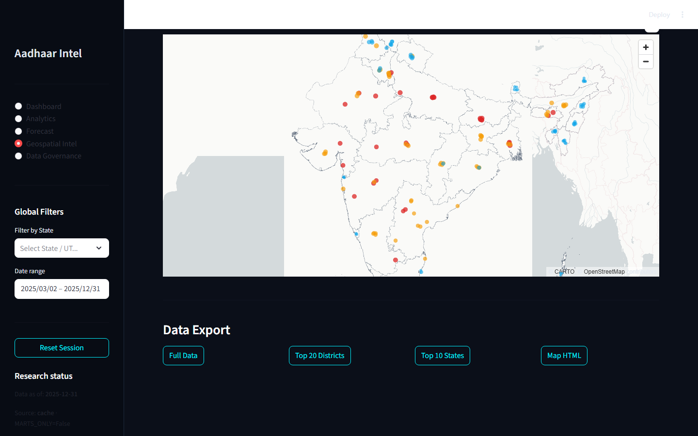

**`[FIGURE — map intensity legend / top districts]`**  
Path: `docs/figures/map_top_districts.png`

### 3.8 Hybrid AI briefs (RQ4)

```text
Engine evidence (metrics, ranks, KPIs)
  → deterministic Insights + Actions
  → optional Ollama prose (must not invent numbers)
  → Key numbers always engine-authored
```

Default model env: `OLLAMA_MODEL` (e.g. `qwen2.5:latest`). Offline → engine-only analysis.

**`[FIGURE — AI panel screenshot]`**  
Path: `docs/figures/ai_brief_dashboard.png`  
Path: `docs/figures/ai_brief_forecast.png`

---

## 4. System architecture and delivery outcomes

### 4.1 Dual UI

| Layer | Entry | Stack |
|-------|--------|--------|
| Research UI | `python main.py` / `streamlit run app.py` | Streamlit, Plotly, pydeck |
| Professional web | `python run_web.py` | FastAPI + React (Vite), Recharts, deck.gl/MapLibre |

Shared core: `DataLoader`, `AnalyticsEngine`, `ForecastBackend`, geo repair, governance store.

**`[FIGURE — UI modules collage]`**

| Module | Live capture | Alternate |
|--------|--------------|-----------|
| Dashboard | 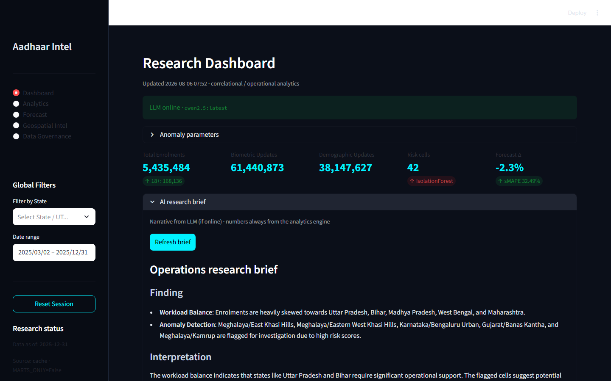 |  |
| Analytics | 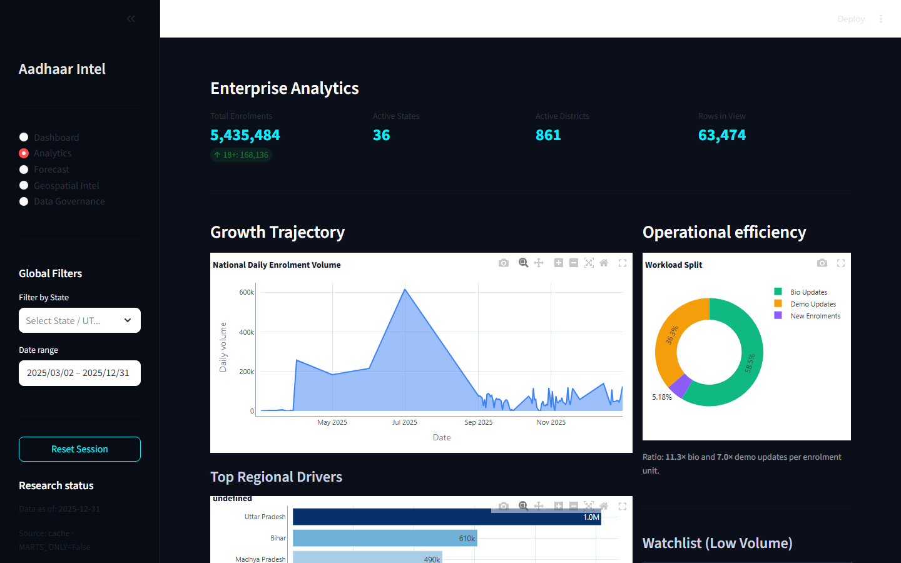 | |
| Forecast | 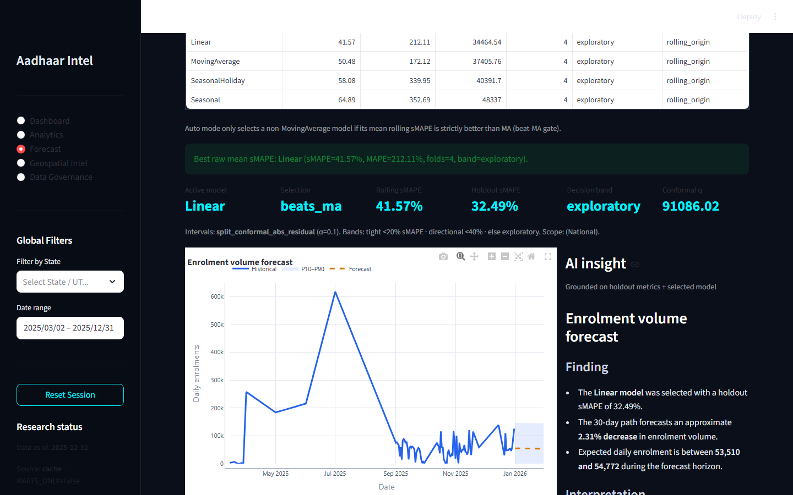 | |
| Geospatial |  | |
| Governance |  | |

### 4.2 Product / engineering outcomes

- **Feature parity** between Streamlit modules and React pages (documented in `web/FEATURE_PARITY.md`).  
- **Single-command web launch** with optional `--skip-build`.  
- **Export paths:** analytics CSV pack, forecast CSV, map CSV (full / top districts / top states), governance pack + audit.  
- **Reproducibility knobs:** seeds, contamination, holdout/rolling folds, conformal α.  

---

## 5. Empirical outcomes (fill after a documented run)

> Record date, UI (Streamlit/Web), filters (states, date range), and git commit SHA for every filled table.

**Run metadata**

| Field | Value |
|-------|-------|
| Date | *YYYY-MM-DD* |
| Git commit | *sha* |
| UI | Streamlit / React `:port` |
| Filters | States: *All / …* · Range: *…* |
| Contamination / min volume | *0.05 / 50* |
| Forecast horizon / scope | *30 / National* |

### 5.1 Operational KPIs

**`[TABLE — fill]`**

| KPI | Value |
|-----|-------|
| Total enrolments | |
| Adult (18+) enrolments | |
| Biometric updates | |
| Demographic updates | |
| Active states / districts | |
| Risk cells flagged | |
| Forecast growth Δ (30d) | |
| Selected model | |
| MASE / sMAPE | |
| Decision band | |

**`[FIGURE — dashboard KPI strip]`**  
Path: `docs/figures/kpi_strip.png`  
*Reference:* 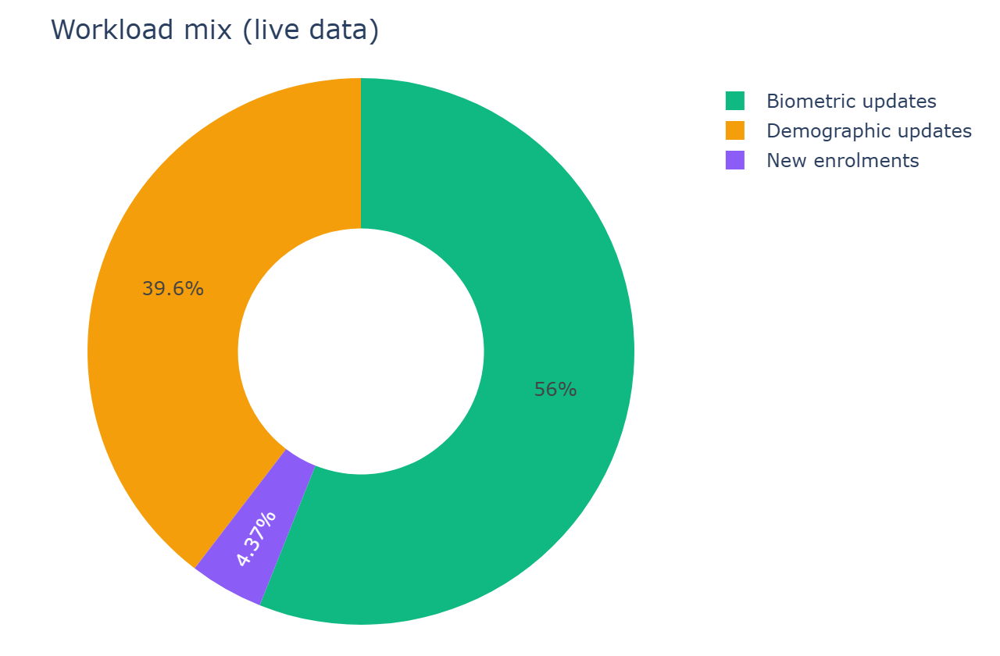

### 5.2 Workload and age structure

**`[FIGURE — age mix / workload mix]`**  
Path: `docs/figures/age_workload_mix.png`  
*Reference:* 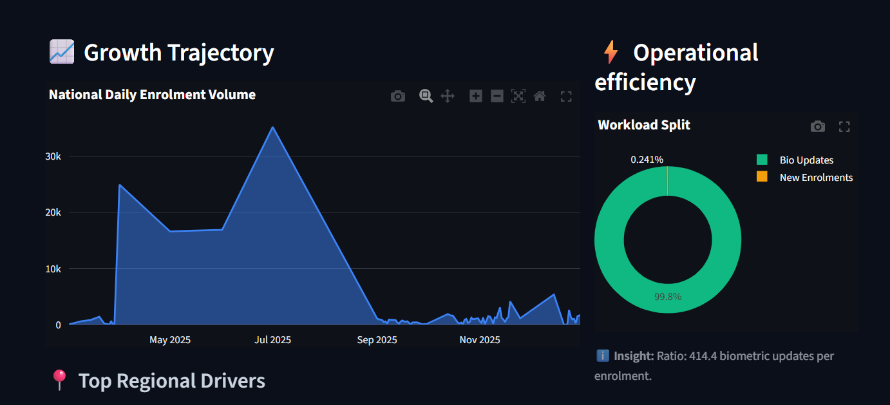

### 5.3 Anomaly investigation summary

**`[TABLE — fill]` Counts by reason / top states by flagged volume**

| Reason code | # cells | Flagged volume |
|-------------|---------|----------------|
| *fill* | | |

**`[FIGURE — risk gradient bars]`**  
Path: `docs/figures/anomaly_risk_bars.png`

### 5.4 Forecast quality and selection

**`[TABLE — fill]` Auto selection audit**

| Item | Value |
|------|-------|
| Best by MASE (raw #1) | |
| Selected after gate | |
| Selection reason | |
| Best baseline MASE | |
| Δ selected vs best baseline | |
| Conformal q | |
| Peak / floor (horizon) | |

### 5.5 Geospatial concentration

**`[TABLE — fill]` Top 5 districts by mapped volume**

| Rank | State | District | Volume | Intensity | Share % |
|------|-------|----------|--------|-----------|---------|
| 1 | | | | | |
| … | | | | | |

**`[FIGURE — map fullscreen / intensity]`**  
Path: `docs/figures/map_fullscreen.png`

### 5.6 Geo evaluation (automated)

Run: `pytest tests/test_geo_repair.py -q` (or project test suite).

**`[TABLE — fill]`**

| Check | Result |
|-------|--------|
| AP→Telangana unit test | pass / fail |
| Gold state accuracy ≥ 0.9 | |
| Gold both accuracy ≥ 0.9 | |
| Forecast unit tests | |

---

## 6. Interpretation and implications

### 6.1 For operations

- **Geo repair + governance** reduce silent geographic bias in state/district rollups before any ML.  
- **Risk cells** prioritise investigation capacity; treat scores as triage, not guilt.  
- **Baseline-gated forecasts** discourage overconfident complex models on noisy series; decision bands communicate use-case fit.  
- **Maps** support regional staffing envelopes when combined with top-district rankings and intensity share.  

### 6.2 For research / methods

- Demonstrates a full **ops research pipeline**: dirty public-sector aggregates → rule-based cleaning → unsupervised outlier detection → multi-model forecast with honest baselines → dual UI.  
- Hybrid AI pattern separates **measurement** (engine) from **narrative** (LLM).  
- Dual UI shows research prototypes can graduate to professional SPA without forking analytics logic.  

### 6.3 Limitations

| Limitation | Mitigation in system / practice |
|------------|----------------------------------|
| Unsupervised anomalies ≠ fraud | Explicit UI/API disclaimers; investigation notes |
| Forecast degradation under breaks | Rolling CV, decision bands, conformal intervals |
| Centroid approx. for some districts | `centroid_source` exposed; prefer district file when present |
| Rule pack coverage gaps | Gold eval + human governance for residuals |
| LLM may restate poorly if unconstrained | Locked metric evidence; hybrid assembly |
| Aggregate data only | No individual-level claims |

---

## 7. Reproducibility and artefacts

### 7.1 Key configuration (as of codebase)

| Parameter | Default |
|-----------|---------|
| `CACHE_SCHEMA_VERSION` | 4 |
| `GEO_RULE_PACK_VERSION` | 1.1.0 |
| `ANOMALY_CONTAMINATION` | 0.05 |
| `ANOMALY_MIN_VOLUME` | 50 |
| `FORECAST_CANDIDATES` | MA, Drift, Ensemble, SeasonalNaive |
| `FORECAST_PRIMARY_METRIC` | mase |
| `FORECAST_BEAT_BASELINE_EPS` | 0.0 |
| `FORECAST_CONFORMAL_ALPHA` | 0.1 |
| `FORECAST_ROLLING_FOLDS` | 4 |
| `FORECAST_RANDOM_SEED` | 42 |

### 7.2 Artefact checklist

| Artefact | Location | Present? |
|----------|----------|----------|
| Parquet marts | `data/processed/` | `[ ]` |
| Manifest | `data/processed/manifest.json` | `[ ]` |
| Governance patches | `output/governance_patches.json` | `[ ]` |
| Audit log | `output/governance_audit.csv` | `[ ]` |
| Live captures | `docs/live_captures/` | `[x]` (seed set) |
| Symposium paper | `docs/*_NSEFCCIC2026_Paper.pdf` | `[x]` |
| Flowchart | `flowchart.md` | `[x]` |
| This outcomes report | `docs/RESEARCH_OUTCOMES.md` | `[x]` |

### 7.3 Recommended figure pack for publication

Create `docs/figures/` and export:

1. Architecture  
2. ETL + geo repair pipeline  
3. Dashboard overview  
4. Anomaly bars + radar  
5. Forecast path + model selection (rank + baseline gate)  
6. Geospatial map + top districts  
7. Governance scan example  
8. Hybrid AI brief (with Key numbers visible)  

---

## 8. Conclusions

The Aadhaar Intel Engine demonstrates that **noisy national-scale identity-system aggregates** can support **transparent operational intelligence** when:

1. Geography is repaired and governed as a first-class pipeline,  
2. Outlier detection is multi-feature and explicitly non-accusatory,  
3. Forecasting is baseline-honest and interval-aware,  
4. AI assists with **evidence-locked** narrative, and  
5. Research and professional UIs share one analytics core.  

Measured outcomes (KPIs, bake-off metrics, geo gold accuracy, risk tables) should be filled from a dated, version-pinned run using the tables and figure slots above.

---

## 9. Appendix A — Figure index (paths)

| Fig. | Description | Path |
|------|-------------|------|
| A1 | Architecture | `images/architecture_diagram.png` |
| A2 | Dashboard (static) | `images/dashboard_main.png` |
| A3 | Dashboard (live) | `docs/live_captures/01_dashboard.png` |
| A4 | Analytics (live) | `docs/live_captures/02_analytics.png` |
| A5 | Forecast (live) | `docs/live_captures/03_forecast.png` |
| A6 | Geospatial (live) | `docs/live_captures/04_geospatial.png` |
| A7 | Governance (live) | `docs/live_captures/05_governance.png` |
| A8 | Anomaly chart | `docs/live_captures/chart_anomalies.png` |
| A9 | Risk radar | `docs/live_captures/chart_risk_radar.png` |
| A10 | Forecast chart | `docs/live_captures/chart_forecast.png` |
| A11 | Bake-off chart | `docs/live_captures/chart_bakeoff.png` |
| A12 | Workload mix | `docs/live_captures/chart_workload_mix.png` |
| A13 | Map (static) | `images/geospatial_map.png` |
| A14 | Resource planning | `images/resource_planning.png` |
| A15+ | *Add new exports here* | `docs/figures/…` |

---

## 10. Appendix B — Placeholder gallery

Copy this block for each new experiment run:

```markdown
### Run: YYYY-MM-DD — short title

**Commit:** `sha` · **UI:** React/Streamlit · **Scope:** …


| KPI | Value |
|-----|-------|
| … | … |
```

---

## 11. References (in-repo)

- `flowchart.md` — system flowcharts  
- `web/FEATURE_PARITY.md` — Streamlit ↔ React parity  
- `docs/build_symposium_paper.py` — paper builder  
- `docs/capture_live_assets.py` — UI/chart capture  
- `tests/test_geo_repair.py`, `tests/test_forecast.py` — automated checks  
- `src/config.py` — knobs cited above  

---

*Generated from the current repository design and implementation. Update tables and figure paths when re-running experiments.*
