# Aadhaar Intel Engine — Detailed Flowcharts

Research-grade operational analytics for **Aadhaar enrolment and update aggregates** (no Aadhaar numbers or biometrics). This document maps data flow, geo repair, analytics, forecasting, UI modules, governance, and LLM briefs as implemented in the codebase.

> **Disclaimer:** Isolation Forest scores and the risk radar are unsupervised outlier rankings (“look here”), not fraud labels. Forecasts are decision-band guides, not guarantees.

---

## 1. System at a glance

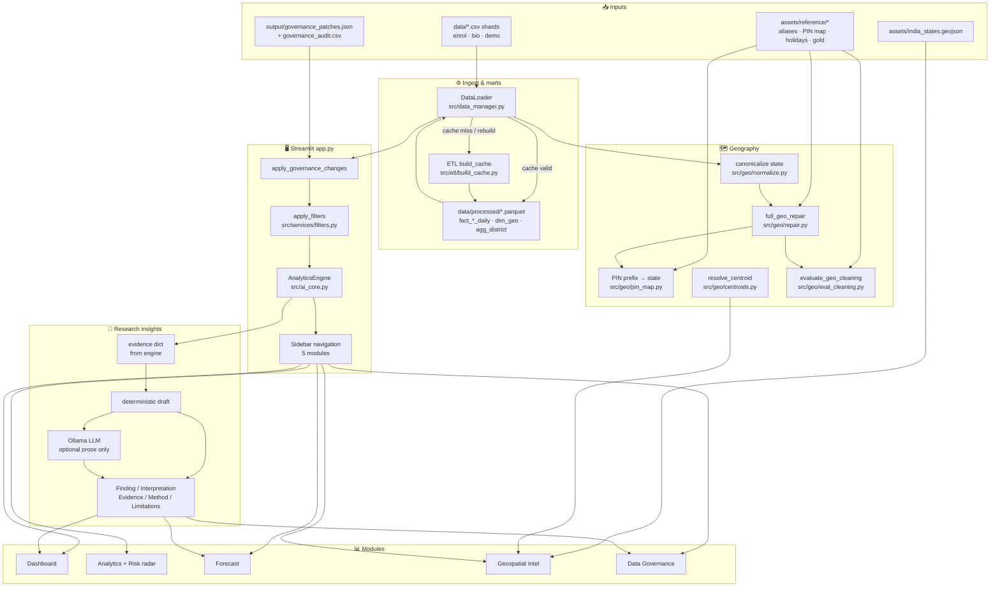

---

## 2. Application startup & routing

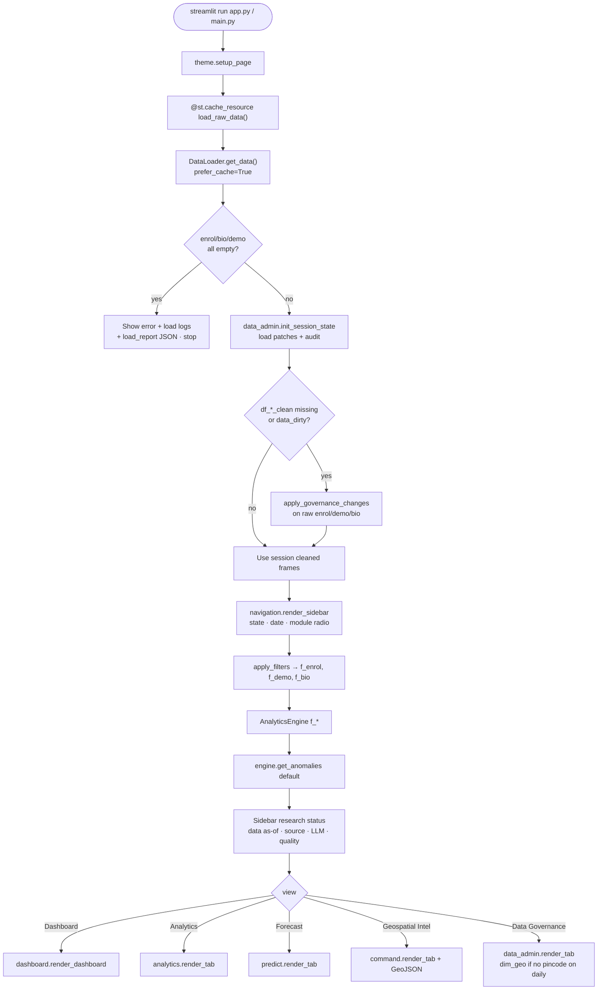

**Key files**

| Step | Module |
|------|--------|
| Entry | `app.py`, `main.py` |
| Load | `src/data_manager.py` → `DataLoader` |
| Filters | `src/services/filters.py` |
| Engine | `src/ai_core.py` → `AnalyticsEngine` |
| Nav | `src/components/navigation.py` |

---

## 3. Data load path (CSV ↔ Parquet marts)


### Processed marts (`data/processed/`)

| Artifact | Grain / role |
|----------|----------------|
| `fact_enrol_daily.parquet` | date × state × district enrolment volumes + age bands |
| `fact_bio_daily.parquet` | date × state × district biometric updates |
| `fact_demo_daily.parquet` | date × state × district demographic updates |
| `dim_geo.parquet` | state × district × sample pincodes (governance / PIN scans) |
| `agg_district.parquet` | district-level enrolment rollups |
| `manifest.json` | source fingerprint, row counts, build metadata |

### Offline rebuild

```text
python -m src.etl.build_cache
# or scripts/refresh_marts.ps1
```

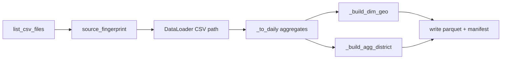

---

## 4. Geography repair pipeline

Order is fixed in `full_geo_repair()`:

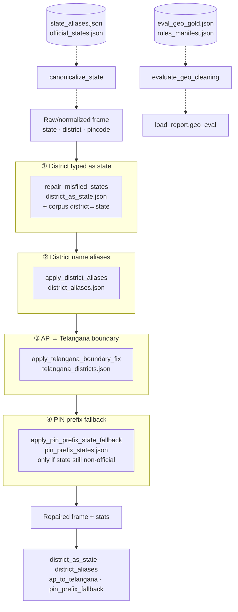

### Centroid resolution (maps only)

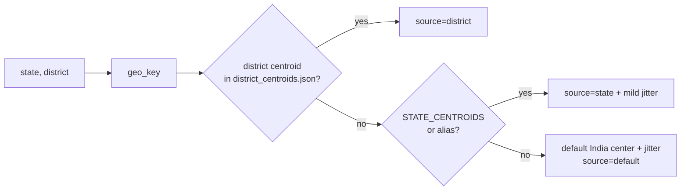

---

## 5. Session governance (human overrides)

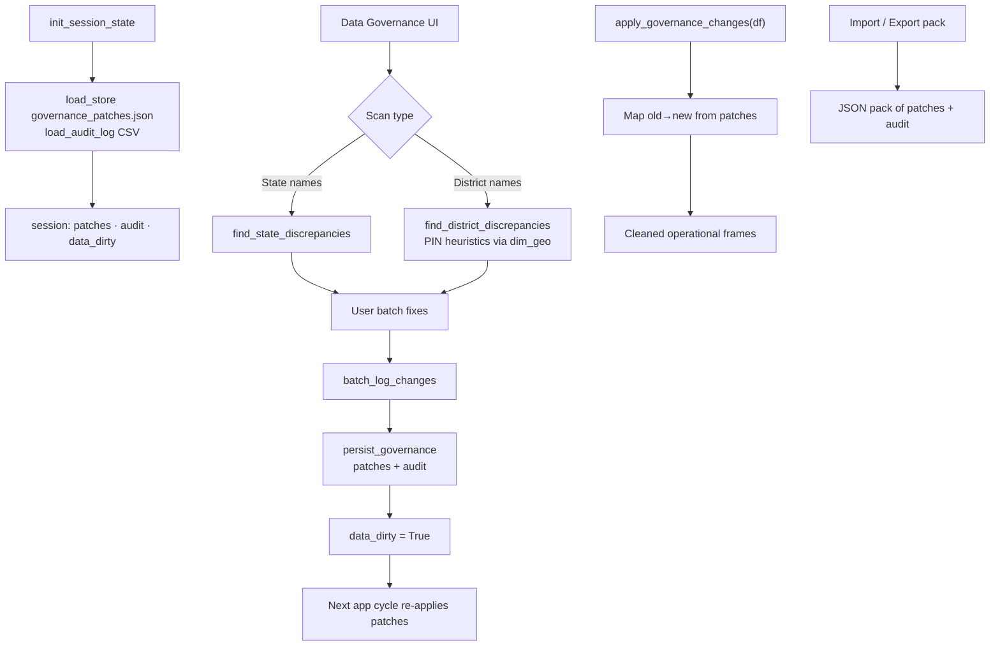

**Durability:** patches live under `output/`; they re-apply on every load so marts + human fixes stay aligned without re-editing CSVs.

---

## 6. AnalyticsEngine — core services

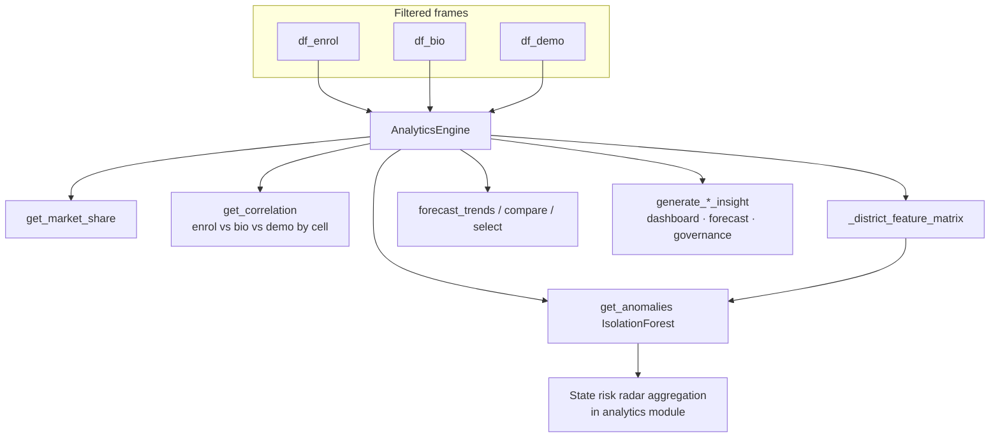

### 6.1 District feature matrix → Isolation Forest

```mermaid
flowchart TD
    EN[Enrol daily by state×district] --> FEAT

    subgraph FEAT["Features per cell"]
        V[volume · log_volume]
        CV[day-to-day CV / volatility]
        BR[bio_ratio]
        DR[demo_ratio]
        WG[wow_growth]
        AD[active_days]
        VS[volume_vs_state_median]
    end

    FEAT --> FILT[min_volume filter]
    FILT --> SCALE[StandardScaler]
    SCALE --> ISO["IsolationForest<br/>contamination · n_estimators=200<br/>random_state fixed"]
    ISO --> LAB[labels −1 outlier / 1 inlier]
    ISO --> SCORE[decision_function → risk_raw]
    SCORE --> NORM[normalize → risk_score 10–100<br/>only for outliers]
    LAB --> REASON[Top |z| feature → reason text]
    NORM --> NOTES[investigation_notes]
    REASON --> OUT[Flagged rows sorted by risk_score]
    NOTES --> OUT
```

**Not fraud detection** — multi-feature peer outliers only.

### 6.2 State risk radar (Analytics UI)

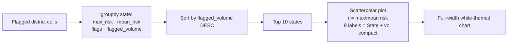

Implementation: `src/modules/analytics.py` → `_state_risk_summary` → `render_state_risk_radar`.

---

## 7. Forecasting flow

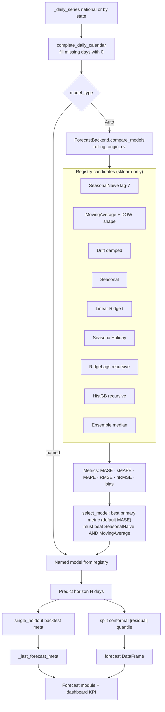

### Decision bands (config)

| Band | MASE (primary) | sMAPE (fallback) | Meaning |
|------|----------------|------------------|---------|
| tight | &lt; 0.85 | &lt; 20% | finer short-horizon planning |
| directional | &lt; 1.15 | &lt; 40% | direction only |
| exploratory | ≥ 1.15 | ≥ 40% | research / monitor actuals |

---

## 8. Module-level UI flows

### 8.1 Dashboard

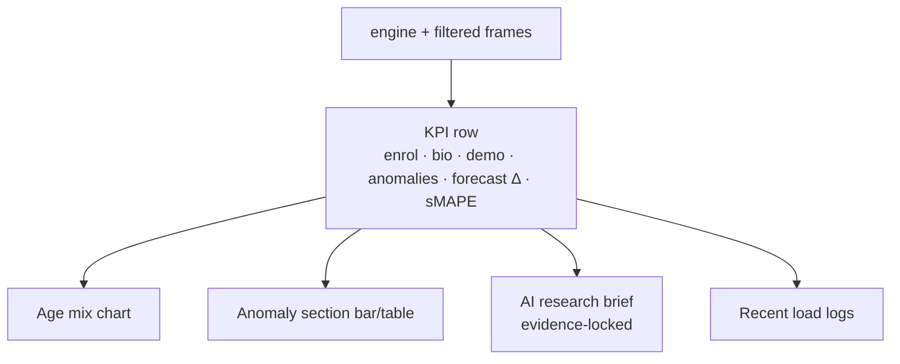

### 8.2 Analytics

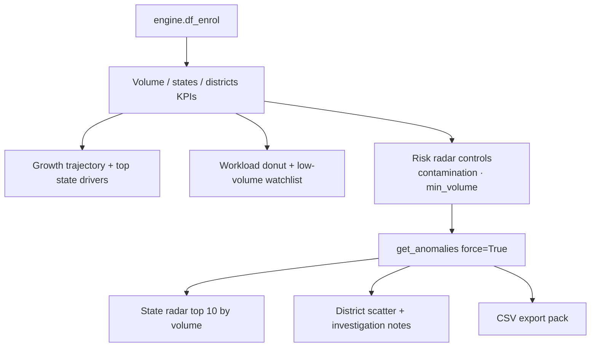

### 8.3 Forecast

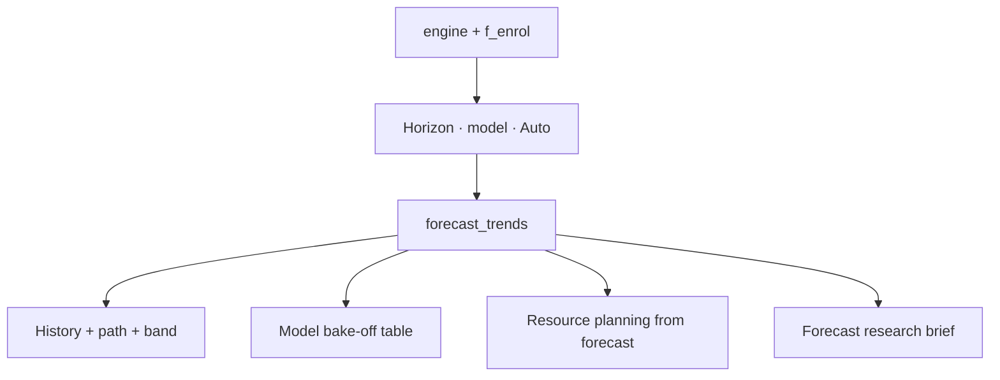

### 8.4 Geospatial Intel

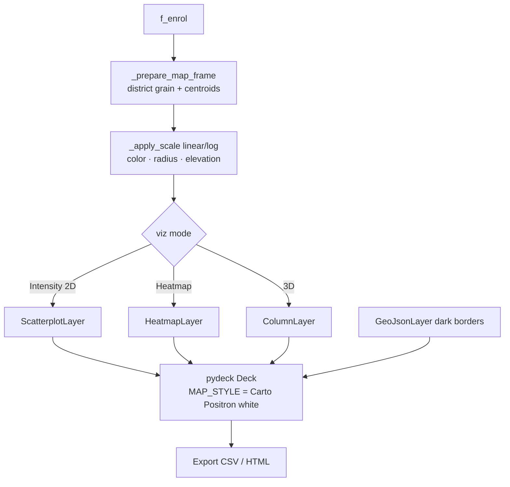

### 8.5 Data Governance

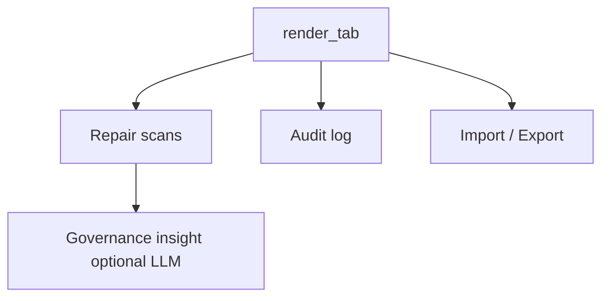

---

## 9. LLM research brief path

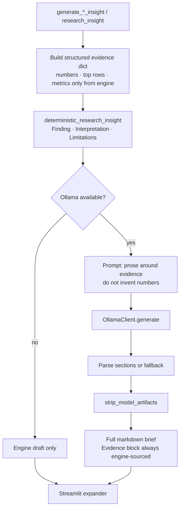

**Invariant:** statistics never originate in the LLM; they are injected as evidence.

---

## 10. End-to-end “happy path” sequence

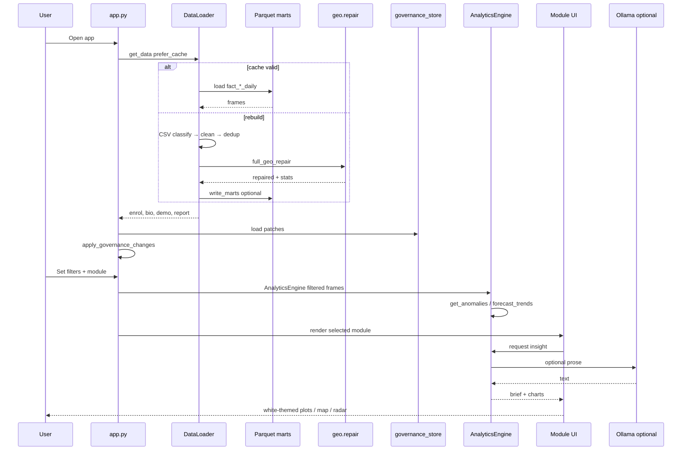

---

## 11. Repository map (where code lives)

```text
Aadhaar-Intel-Engine-UIDAI/
├── app.py / main.py              # Streamlit entry & routing
├── data/                         # CSV shards + processed marts
├── assets/reference/             # Geo rule packs, holidays, gold eval
├── output/                       # Governance patches & audit
├── docs/                         # Paper builder + live captures
├── tests/                        # forecast · geo repair · pin/manifest
└── src/
    ├── config.py                 # Paths, anomaly & forecast knobs
    ├── data_manager.py           # DataLoader
    ├── ai_core.py                # AnalyticsEngine
    ├── forecasting.py            # ForecastBackend
    ├── etl/build_cache.py        # Mart build CLI
    ├── geo/                      # normalize · repair · pin · centroids · eval
    ├── modules/                  # dashboard · analytics · predict · command · data_admin
    ├── services/                 # filters · governance_store
    ├── ai/                       # ollama_client · research_insights
    ├── components/navigation.py
    └── utils/                    # theme · plots white theme
```

---

## 12. Data contracts (operational grain)

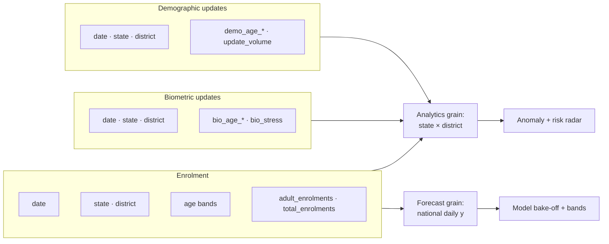

**Daily marts** drop pincode (aggregated). **dim_geo** keeps sample pincodes for governance PIN heuristics.

---

## 13. Configuration touchpoints

| Concern | Config / assets |
|---------|-----------------|
| Data paths | `src/config.py` → `DATA_DIR`, `PROCESSED_DIR`, `MARTS_ONLY`, `AUTO_BUILD_CACHE` |
| Anomaly defaults | `ANOMALY_CONTAMINATION`, `ANOMALY_MIN_VOLUME` |
| Forecast | `FORECAST_CANDIDATES`, `FORECAST_HOLDOUT_DAYS`, `FORECAST_RANDOM_SEED` |
| Holidays | `assets/reference/india_holidays.json` |
| Geo rules | `official_states`, `state_aliases`, `district_*`, `pin_prefix_states`, `telangana_districts`, `rules_manifest` |
| Map basemap | `command.MAP_STYLE` Carto Positron (light/white) |
| Plot chrome | `src/utils/plots.py` white Plotly theme |

---

## 14. Refresh & paper asset loop (research)

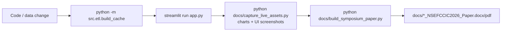

---

## 15. Quick mental model

```text
CSV shards
   ↓  classify · validate · dedup
State canonicalize + full_geo_repair (+ optional gold eval)
   ↓
Parquet daily marts  ← fingerprint cache
   ↓
Human governance patches (durable)
   ↓
Global filters (state / date)
   ↓
AnalyticsEngine
   ├─ Isolation Forest → district flags → state risk radar (by volume)
   ├─ Forecast bake-off → Auto select vs MA → conformal band
   ├─ Correlation / market share / KPIs
   └─ Evidence → deterministic brief → optional Ollama prose
   ↓
Streamlit modules (Dashboard · Analytics · Forecast · White map · Governance)
```

---

*Generated for the Aadhaar Intel Engine repository. Keep this file updated when pipeline stages or module boundaries change.*
