# Aadhaar Intel Engine — System Flowcharts

Research-grade operational analytics for **Aadhaar enrolment and update aggregates** (no Aadhaar numbers or biometrics). This document maps data flow, geo repair, analytics, forecasting, dual UIs (Streamlit + React), governance, and LLM briefs as implemented in the repository.

> **Disclaimer:** Isolation Forest scores and the risk radar are unsupervised outlier rankings (“look here”), not fraud labels. Forecasts are decision-band guides, not guarantees.

---

## 1. System at a glance

Two presentation layers share one Python analytics stack:

| Layer | Entry | Stack |
|-------|--------|--------|
| **Streamlit research UI** | `python main.py` or `streamlit run app.py` | Plotly, pydeck, Streamlit modules |
| **Professional web UI** | `python run_web.py` | React (Vite) + FastAPI + Recharts + deck.gl |

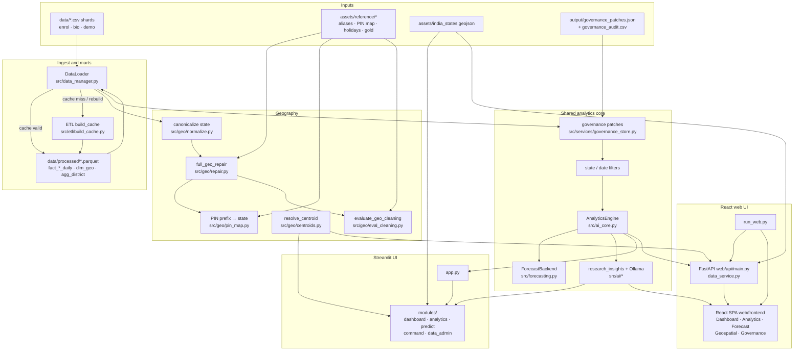

---

## 2. Dual entry points and routing

### 2.1 Launch paths

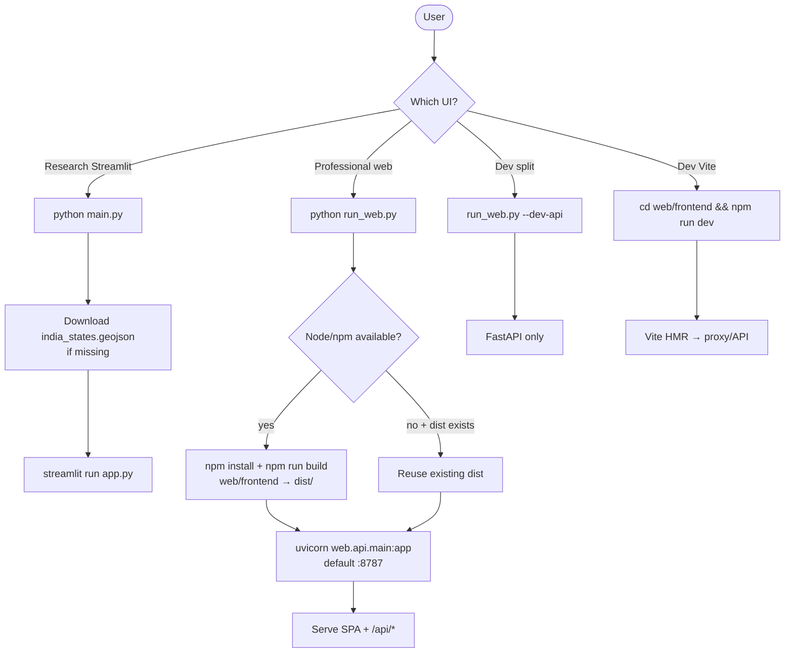

### 2.2 Streamlit startup (`app.py`)

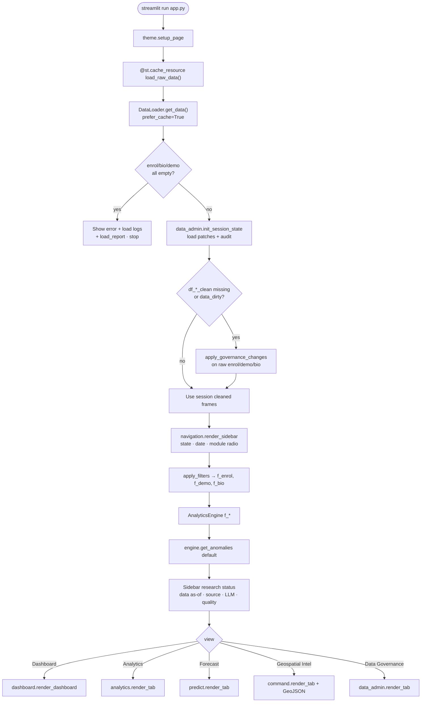

### 2.3 React + FastAPI request path

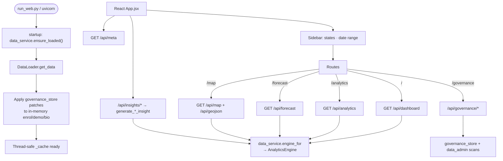

**Key files**

| Step | Module |
|------|--------|
| Streamlit entry | `app.py`, launcher `main.py` |
| Web launcher | `run_web.py` |
| Load | `src/data_manager.py` → `DataLoader` |
| Web cache / filters | `web/api/data_service.py` |
| REST API | `web/api/main.py` |
| Engine | `src/ai_core.py` → `AnalyticsEngine` |
| Streamlit nav | `src/components/navigation.py` |
| React shell | `web/frontend/src/App.jsx` |

---

## 3. FastAPI surface (web UI)

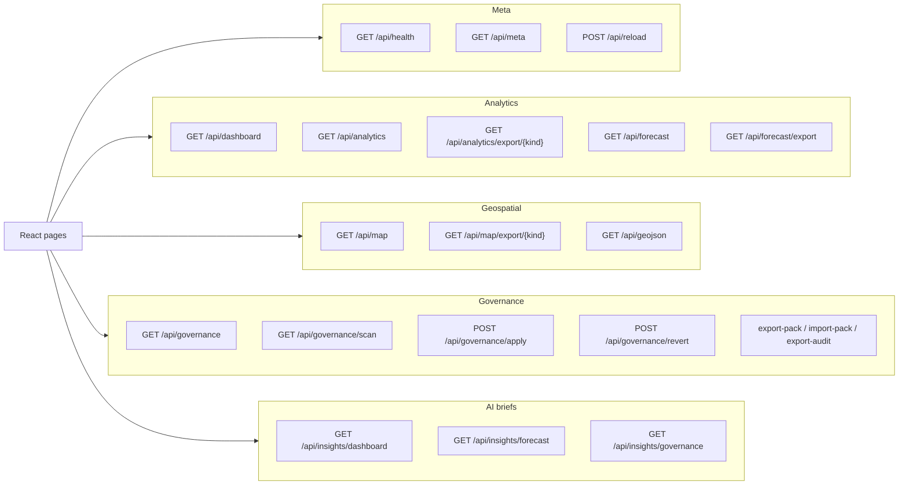

| React page | Primary APIs | Visualization |
|------------|--------------|---------------|
| `Dashboard.jsx` | `/api/dashboard`, insights | Recharts + `AiPanel` |
| `Analytics.jsx` | `/api/analytics`, exports | Recharts (area, bar, pie, radar, scatter) |
| `Forecast.jsx` | `/api/forecast`, insights, export | Recharts composed + bake-off table |
| `Geospatial.jsx` | `/api/map`, `/api/geojson`, exports | deck.gl + MapLibre (Positron) |
| `Governance.jsx` | governance CRUD + insight | Issue cards, audit table, pack I/O |

Shared React components: `KpiCard`, `AiPanel`, `MarkdownBlock`, `api.js`.

---

## 4. Data load path (CSV ↔ Parquet marts)

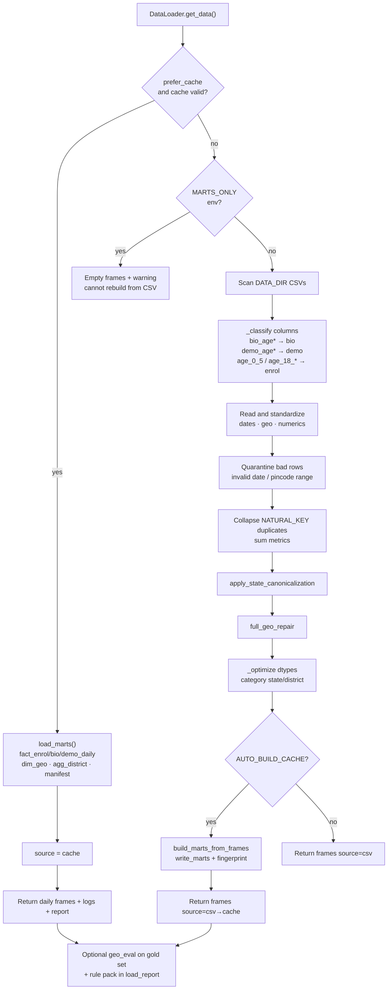

### Processed marts (`data/processed/`)

| Artifact | Grain / role |
|----------|----------------|
| `fact_enrol_daily.parquet` | date × state × district enrolment volumes + age bands |
| `fact_bio_daily.parquet` | date × state × district biometric updates |
| `fact_demo_daily.parquet` | date × state × district demographic updates |
| `dim_geo.parquet` | state × district × sample pincodes (governance / PIN scans) |
| `agg_district.parquet` | district-level enrolment rollups |
| `manifest.json` | source fingerprint, row counts, schema version, build metadata |

### Offline rebuild

```text
python -m src.etl.build_cache
# or scripts/refresh_marts.ps1
```

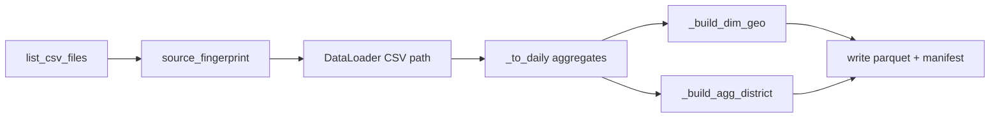

---

## 5. Geography repair pipeline

Order is fixed in `full_geo_repair()`:


### Centroid resolution (maps only)

Shared by Streamlit `command.py` and FastAPI `_map_frame` via `resolve_centroid`:

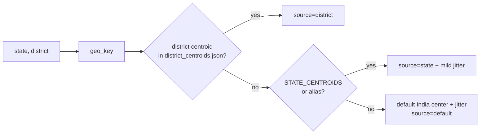

---

## 6. Session / durable governance

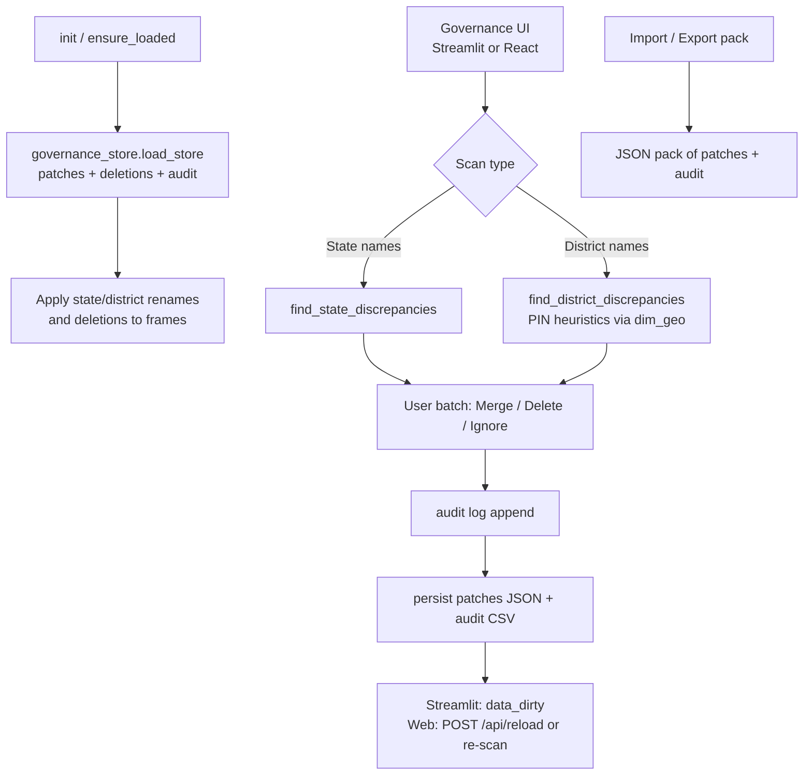

**Durability:** patches live under `output/`; they re-apply on every load so marts + human fixes stay aligned without re-editing CSVs.

---

## 7. AnalyticsEngine — core services


### 7.1 District feature matrix → Isolation Forest

```mermaid
flowchart TD
    EN[Enrol daily by state×district] --> FEAT

    subgraph FEAT["Features per cell"]
        V[volume · log_volume]
        CV[day-to-day CV / volatility]
        BR[bio_ratio]
        DR[demo_ratio]
        WG[wow_growth]
        AD[active_days]
        VS[volume_vs_state_median]
    end

    FEAT --> FILT[min_volume filter]
    FILT --> SCALE[StandardScaler]
    SCALE --> ISO["IsolationForest<br/>contamination · n_estimators=200<br/>random_state fixed"]
    ISO --> LAB[labels −1 outlier / 1 inlier]
    ISO --> SCORE[decision_function → risk_raw]
    SCORE --> NORM[normalize → risk_score 10–100<br/>only for outliers]
    LAB --> REASON[Top |z| feature → reason text]
    NORM --> NOTES[investigation_notes]
    REASON --> OUT[Flagged rows sorted by risk_score]
    NOTES --> OUT
```

**Not fraud detection** — multi-feature peer outliers only.

### 7.2 State risk radar (Analytics)

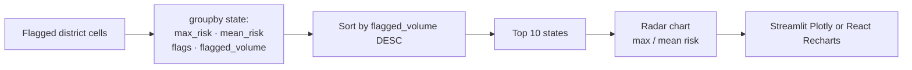

---

## 8. Forecasting flow

Candidates (config `FORECAST_CANDIDATES`): **MovingAverage**, **Drift**, **Ensemble**, **SeasonalNaive**.

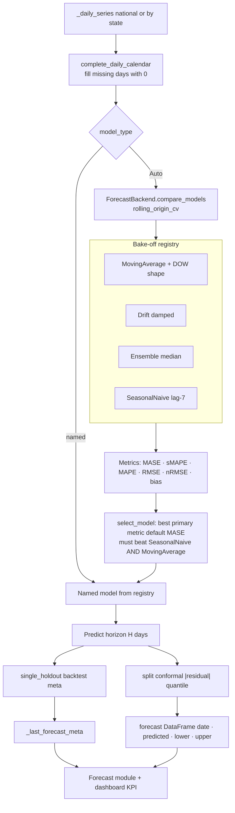

### Decision bands (config)

| Band | MASE (primary) | sMAPE (fallback) | Meaning |
|------|----------------|------------------|---------|
| tight | &lt; 0.85 | &lt; 20% | finer short-horizon planning |
| directional | &lt; 1.15 | &lt; 40% | direction only |
| exploratory | ≥ 1.15 | ≥ 40% | research / monitor actuals |

---

## 9. Module-level UI flows

### 9.1 Dashboard

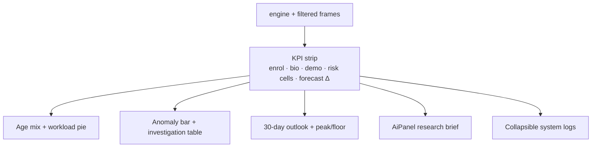

### 9.2 Analytics

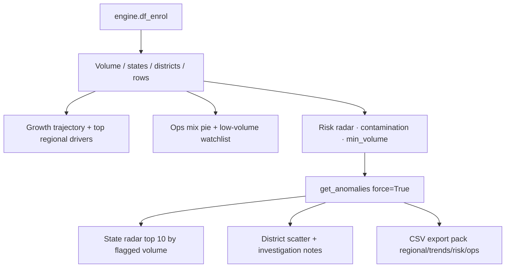

### 9.3 Forecast

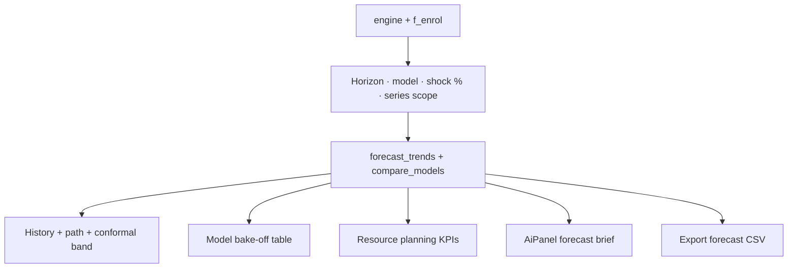

### 9.4 Geospatial Intel (Streamlit pydeck ⟷ React deck.gl)

Both UIs share the same preparation logic (centroids, log/linear scale, intensity bands, GeoJSON borders, Carto Positron basemap):

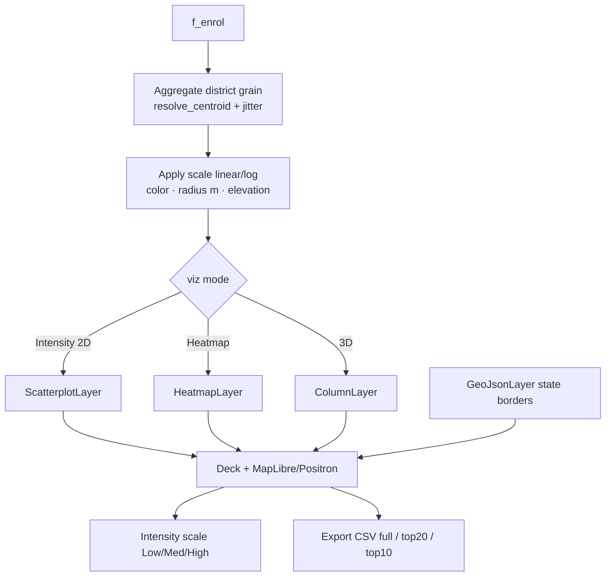

| Concern | Streamlit | React |
|---------|-----------|-------|
| Entry | `src/modules/command.py` | `GET /api/map` + `Geospatial.jsx` |
| Layers | pydeck | deck.gl 9 + react-map-gl/maplibre |
| Depth default | Top 5 Priority | `top5` |
| HTML export | pydeck `to_html` | not exposed |

### 9.5 Data Governance

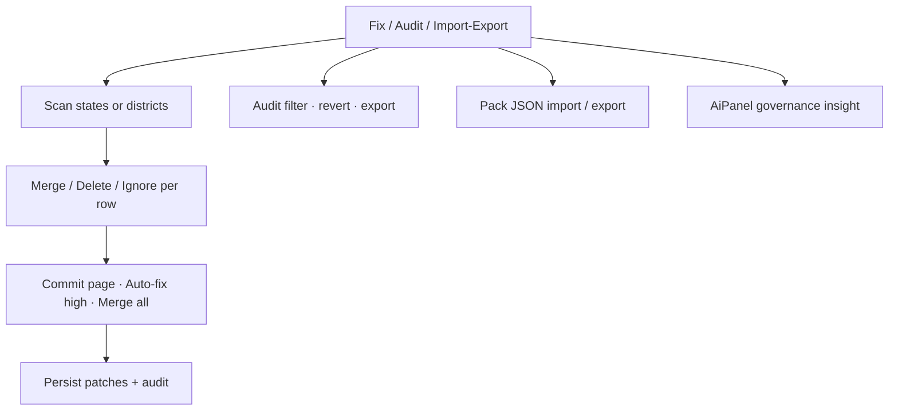

---

## 10. LLM research brief path

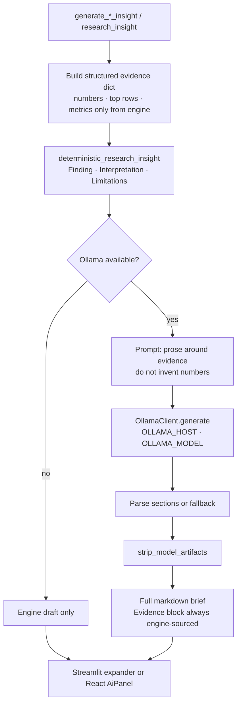

**Invariant:** statistics never originate in the LLM; they are injected as evidence.

Defaults: `OLLAMA_HOST=http://127.0.0.1:11434`, `OLLAMA_MODEL=qwen2.5:latest`.

---

## 11. End-to-end sequences

### 11.1 Streamlit happy path

```mermaid
sequenceDiagram
    participant U as User
    participant App as app.py
    participant DL as DataLoader
    participant Marts as Parquet marts
    participant Geo as geo.repair
    participant Gov as governance_store
    participant Eng as AnalyticsEngine
    participant UI as Module UI
    participant LLM as Ollama optional

    U->>App: Open Streamlit
    App->>DL: get_data prefer_cache
    alt cache valid
        DL->>Marts: load fact_*_daily
        Marts-->>DL: frames
    else rebuild
        DL->>DL: CSV classify → clean → dedup
        DL->>Geo: full_geo_repair
        Geo-->>DL: repaired + stats
        DL->>Marts: write_marts optional
    end
    DL-->>App: enrol, bio, demo, report
    App->>Gov: load patches
    App->>App: apply_governance_changes
    U->>App: Set filters + module
    App->>Eng: AnalyticsEngine filtered frames
    Eng->>Eng: get_anomalies / forecast_trends
    App->>UI: render selected module
    UI->>Eng: request insight
    Eng->>LLM: optional prose
    LLM-->>Eng: text
    Eng-->>UI: brief + charts
    UI-->>U: plots / map / radar
```

### 11.2 React web happy path

```mermaid
sequenceDiagram
    participant U as User
    participant SPA as React SPA
    participant API as FastAPI
    participant DS as data_service
    participant Eng as AnalyticsEngine
    participant LLM as Ollama optional

    U->>SPA: Open :8787
    SPA->>API: GET /api/meta
    API->>DS: ensure_loaded
    DS-->>API: states · dates · LLM status · load_report
    API-->>SPA: meta

    U->>SPA: Filters + open Dashboard
    SPA->>API: GET /api/dashboard?states&start&end&…
    API->>DS: filter_frames + engine_for
    DS->>Eng: KPIs · anomalies · forecast slice
    Eng-->>API: JSON payload
    API-->>SPA: kpis · charts · logs
    SPA-->>U: Recharts dashboard

    U->>SPA: Generate AI insight
    SPA->>API: GET /api/insights/dashboard
    API->>Eng: generate_dashboard_insight
    Eng->>LLM: optional prose
    LLM-->>Eng: markdown
    Eng-->>SPA: markdown
    SPA-->>U: AiPanel

    U->>SPA: Geospatial map
    SPA->>API: GET /api/map + /api/geojson
    API-->>SPA: points · colors · elevations · borders
    SPA-->>U: deck.gl map
```

---

## 12. Repository map

```text
Aadhaar-Intel-Engine-UIDAI/
├── main.py                         # Streamlit launcher + GeoJSON download
├── app.py                          # Streamlit application & routing
├── run_web.py                      # React UI launcher (build + uvicorn)
├── flowchart.md                    # This document
├── requirements.txt
├── data/                           # CSV shards + processed/ marts
├── assets/
│   ├── india_states.geojson
│   └── reference/                  # Geo rules, holidays, gold eval
├── output/                         # Governance patches & audit
├── docs/                           # Paper builder + live captures
├── tests/                          # forecast · geo repair · pin/manifest
├── web/
│   ├── FEATURE_PARITY.md           # Streamlit ↔ React parity notes
│   ├── api/
│   │   ├── main.py                 # FastAPI routes
│   │   └── data_service.py         # Load cache, filters, engine_for
│   └── frontend/                   # React + Vite SPA
│       └── src/
│           ├── App.jsx             # Shell · sidebar · routes
│           ├── api.js
│           ├── components/         # KpiCard · AiPanel · MarkdownBlock
│           └── pages/              # Dashboard · Analytics · Forecast
│                                   # Geospatial · Governance
└── src/
    ├── config.py                   # Paths, anomaly & forecast knobs
    ├── data_manager.py             # DataLoader
    ├── ai_core.py                  # AnalyticsEngine
    ├── forecasting.py              # ForecastBackend
    ├── etl/build_cache.py          # Mart build CLI
    ├── geo/                        # normalize · repair · pin · centroids · eval
    ├── modules/                    # Streamlit: dashboard · analytics · predict
    │                               # command · data_admin
    ├── services/                   # filters · governance_store
    ├── ai/                         # ollama_client · research_insights
    ├── components/navigation.py
    └── utils/                      # theme · plots
```

---

## 13. Data contracts (operational grain)

```mermaid
flowchart LR
    subgraph Enrol["Enrolment"]
        E1[date]
        E2[state · district]
        E3[age bands]
        E4[adult_enrolments · total_enrolments]
    end

    subgraph Bio["Biometric updates"]
        B1[date · state · district]
        B2[bio_age_* · bio_stress]
    end

    subgraph Demo["Demographic updates"]
        D1[date · state · district]
        D2[demo_age_* · update_volume]
    end

    Enrol --> Cell["Analytics grain:<br/>state × district"]
    Bio --> Cell
    Demo --> Cell
    Enrol --> Nat["Forecast grain:<br/>national or state daily y"]
    Cell --> Risk[Anomaly + risk radar + map]
    Nat --> Fcst[Model bake-off + bands]
```

**Daily marts** drop pincode (aggregated). **dim_geo** keeps sample pincodes for governance PIN heuristics.

Natural key on raw CSV grain: `date · state · district · pincode` (`NATURAL_KEY`).

---

## 14. Configuration touchpoints

| Concern | Config / assets |
|---------|-----------------|
| Data paths | `src/config.py` → `DATA_DIR`, `PROCESSED_DIR`, `MARTS_ONLY`, `AUTO_BUILD_CACHE` |
| Cache schema | `CACHE_SCHEMA_VERSION`, `GEO_RULE_PACK_VERSION` |
| Anomaly defaults | `ANOMALY_CONTAMINATION`, `ANOMALY_MIN_VOLUME` |
| Forecast | `FORECAST_CANDIDATES`, holdout/rolling knobs, `FORECAST_PRIMARY_METRIC`, conformal α |
| Holidays | `assets/reference/india_holidays.json` |
| Geo rules | official_states, aliases, district_*, pin_prefix, telangana, rules_manifest |
| LLM | `OLLAMA_HOST`, `OLLAMA_MODEL` |
| Map basemap | Carto Positron (Streamlit `command.MAP_STYLE` / React `MAP_STYLE`) |
| Plot chrome | Streamlit: `src/utils/plots.py`; React: Recharts + CSS |

---

## 15. Refresh and paper asset loop

```mermaid
flowchart LR
    CODE[Code / data change] --> MART[python -m src.etl.build_cache]
    MART --> APP[streamlit run app.py<br/>and/or python run_web.py]
    APP --> CAP[python docs/capture_live_assets.py<br/>charts + UI screenshots]
    CAP --> PAPER[python docs/build_symposium_paper.py]
    PAPER --> DOCX[docs/*_NSEFCCIC2026_Paper.docx/pdf]
```

---

## 16. Quick mental model

```text
CSV shards
   ↓  classify · validate · dedup
State canonicalize + full_geo_repair (+ optional gold eval)
   ↓
Parquet daily marts  ← fingerprint cache
   ↓
Human governance patches (durable under output/)
   ↓
┌──────────────────────┬──────────────────────┐
│ Streamlit app.py     │ FastAPI data_service │
│ session filters      │ query filters        │
└──────────┬───────────┴──────────┬───────────┘
           ↓                      ↓
              AnalyticsEngine
   ├─ Isolation Forest → district flags → state risk radar
   ├─ Forecast bake-off (MA / Drift / Ensemble / SeasonalNaive)
   │     → Auto select vs baselines → conformal band
   ├─ Correlation / market share / KPIs
   └─ Evidence → deterministic brief → optional Ollama prose
           ↓                      ↓
   Streamlit modules         React pages (parity)
   dashboard · analytics     Dashboard · Analytics
   predict · command         Forecast · Geospatial
   data_admin                Governance
```

---

## 17. Feature parity note

React web UI is maintained at feature parity with Streamlit modules (see `web/FEATURE_PARITY.md`). Intentional gaps:

- Map HTML export (`pydeck.to_html`) is Streamlit-only
- Visual chrome differs (custom React CSS vs Streamlit theme)

Core data, anomalies, forecast bake-off, governance store, and LLM evidence path are shared.

---

*Updated for the dual Streamlit + React/FastAPI architecture. Keep this file in sync when pipeline stages, API routes, or module boundaries change.*
